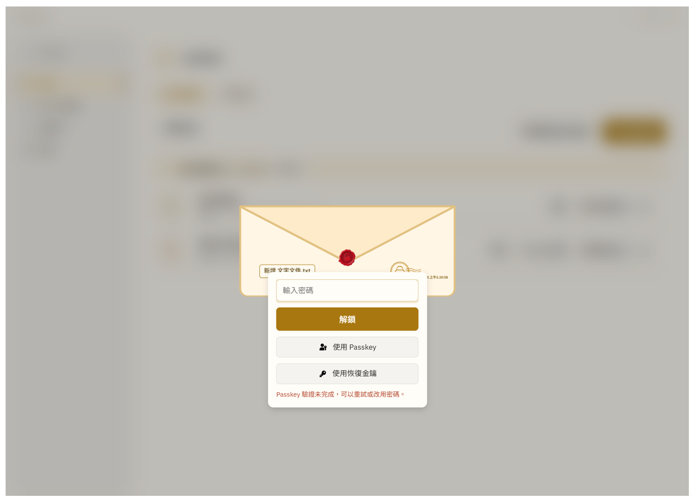
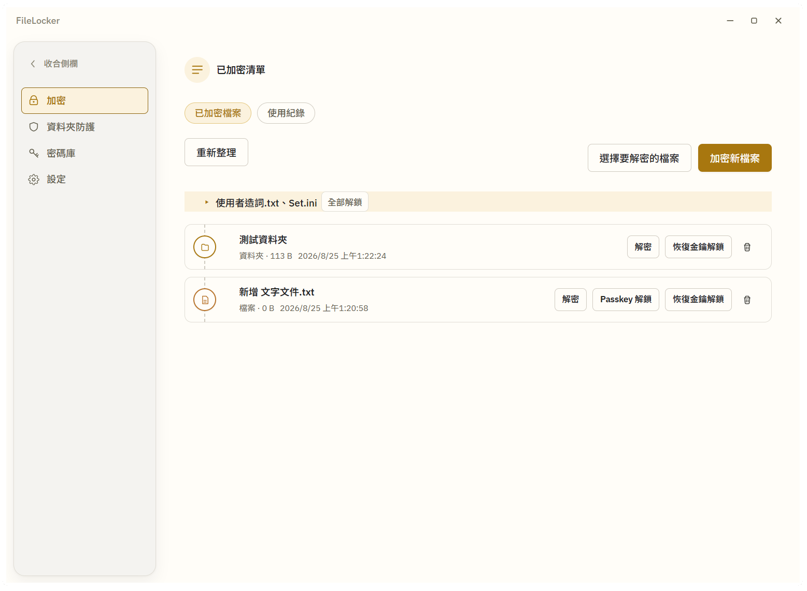
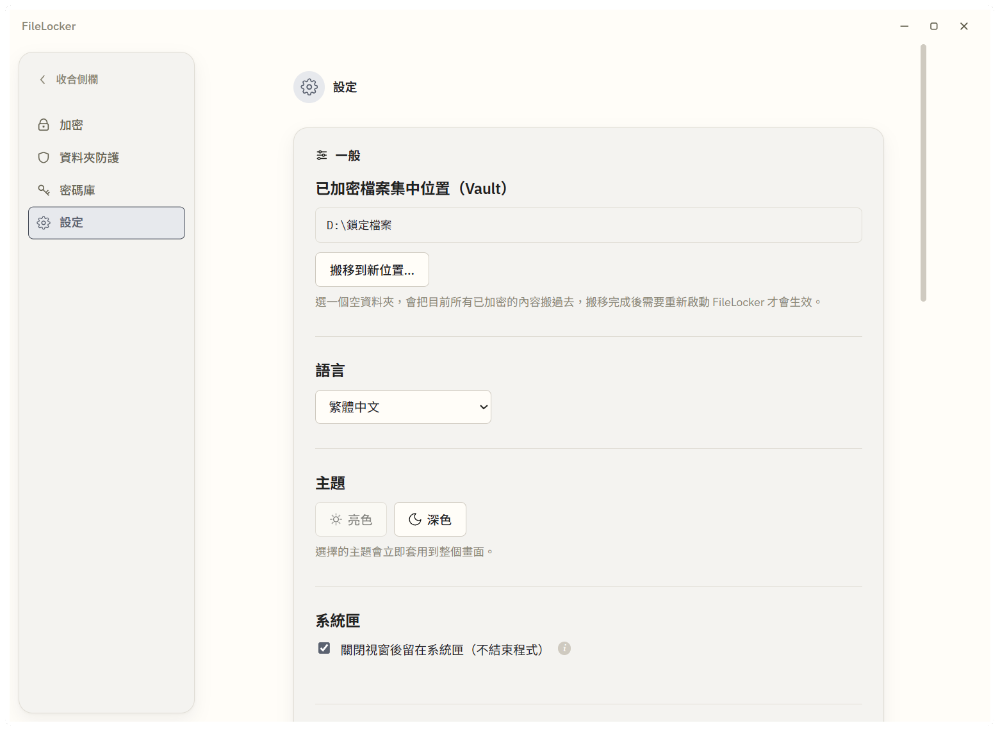
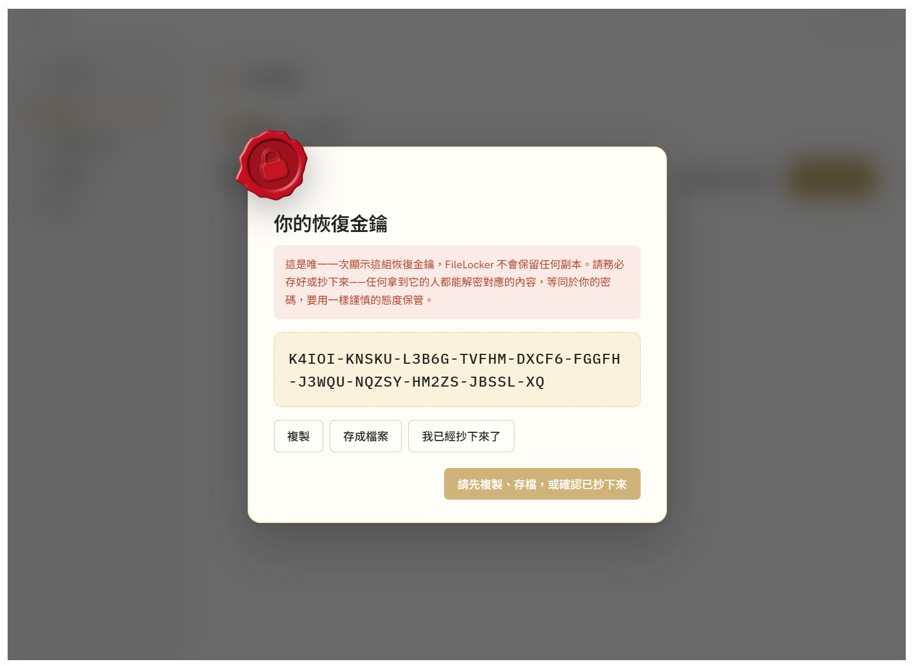
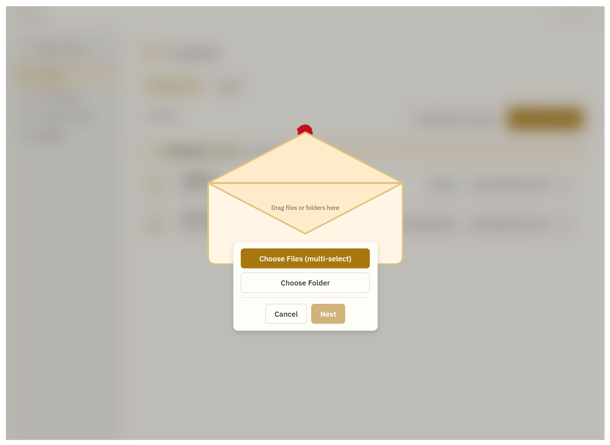
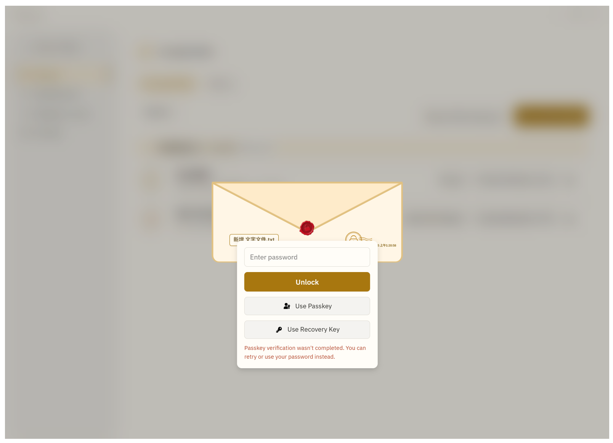
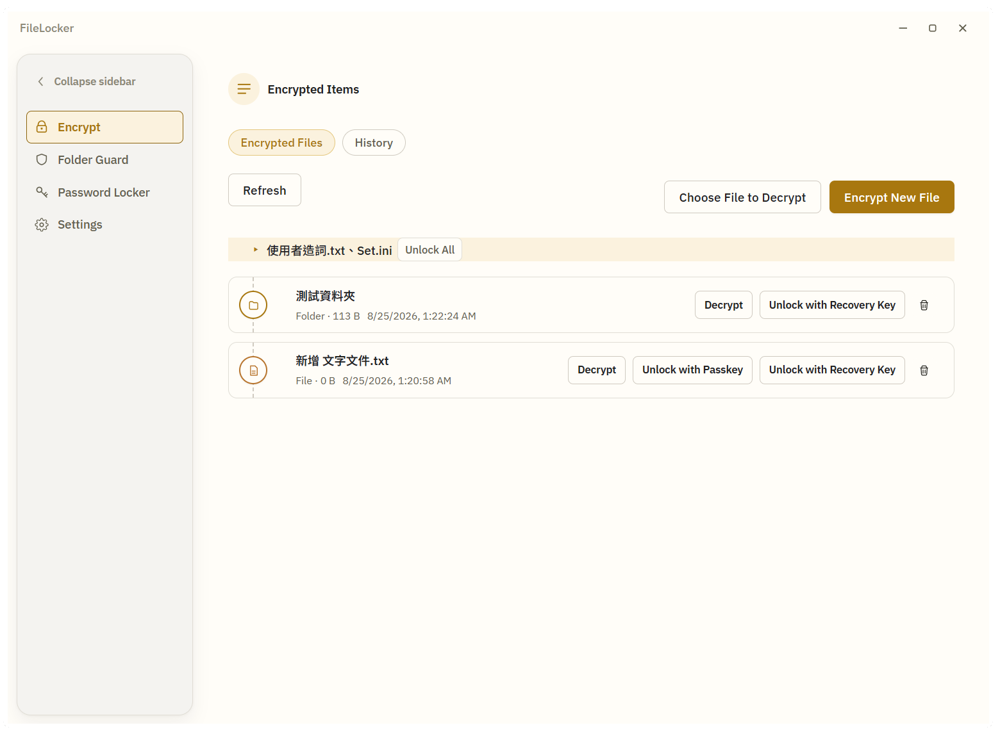
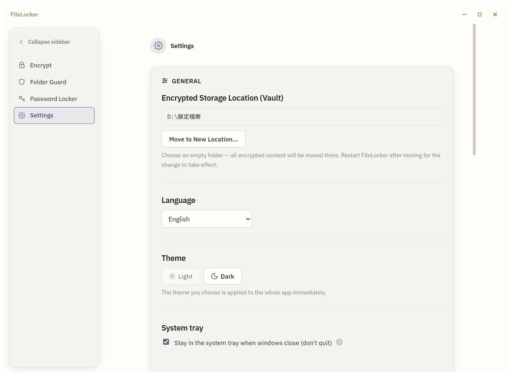
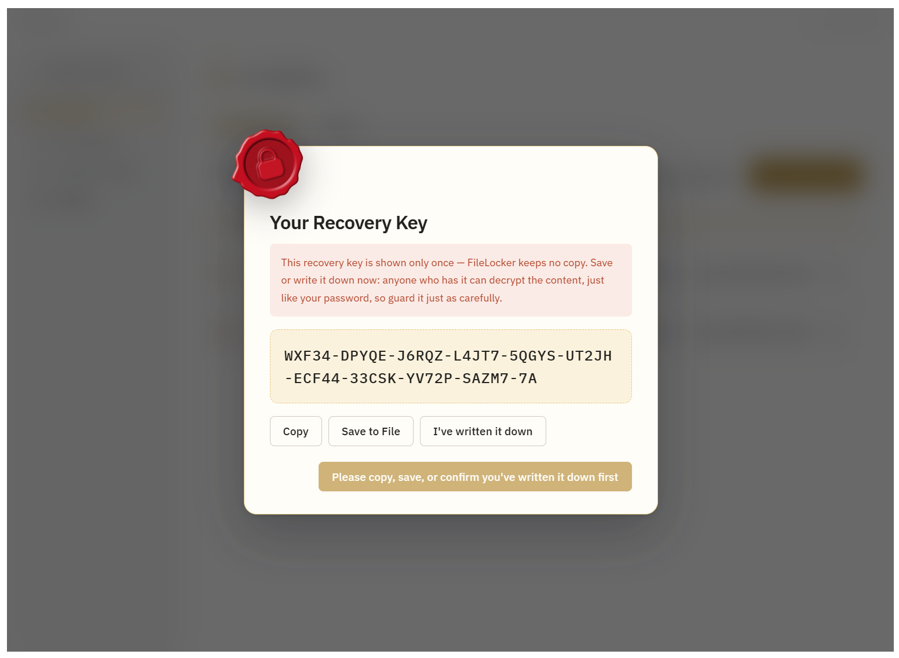

<div align="center">
  

  # FileLocker

  Windows 檔案／資料夾加密工具 — Password · Passkey · Recovery Key
  三種互相獨立的解鎖方式，密碼永不外流。

  [繁體中文](#繁體中文) · [English](#english)
</div>

---

> **開發說明／Development note**：本專案開發過程中使用 AI 輔助工具（Claude Code）協助程式撰寫、重構與文件整理，所有程式碼經過人工審查與測試。
> This project was developed with AI-assisted tooling (Claude Code) for coding, refactoring, and documentation, with all code human-reviewed and tested.

---

## 繁體中文

### 這是什麼

在檔案總管選取檔案或資料夾，右鍵一鍵加密：內容會被移到集中管理的 Vault，原位置只留下一個 `.locked` 指標檔。雙擊指標檔，或在 App 裡操作，輸入密碼（也可以用 Windows Hello Passkey，或事先存好的恢復金鑰）即可還原回原本位置。

### 下載與安裝

前往 [Releases](https://github.com/lx-kvn/FileLocker/releases) 頁面下載最新安裝檔。安裝程式由作者自己開發的另一個專案 [mac-style-windows-installer](https://github.com/lx-kvn/mac-style-windows-installer) 打包產生，目前尚未申請數位簽章，第一次執行時 Windows SmartScreen 可能會跳出警告——點「其他資訊」→「仍要執行」即可繼續安裝。

- **Argon2id + AES-256-GCM**：密碼經 Argon2id 衍生金鑰，內容用 AES-256-GCM 串流分塊加密，加密大型資料夾也不需要把整份明文塞進記憶體。
- **三種互相獨立的解鎖方式**：密碼（必要）、Passkey（Windows Hello，裝置綁定）、恢復金鑰（一次性顯示的備援代碼）。
- **右鍵選單批次加密**：一次選取多個檔案/資料夾，右鍵直接加密；CLI 也支援批次加密／解密／刪除，安裝完成後直接加入系統 PATH，任何終端機都能用，並提供 `--password-stdin`／`--yes` 等旗標的靜默批次模式，方便寫進指令碼或排程工作。
- **資料夾防護（Folder Guard）**：獨立於加密之外的第二種保護方式，純粹透過 Windows 存取權限（ACL）限制資料夾，不加密內容——防隨手瀏覽，不防蓄意繞過。右鍵直接上鎖／解鎖，共用密碼＋選配 Passkey；進階選配可開啟「使用 .lockfolder 開啟上鎖資料夾」，雙擊標記檔直接跳出解鎖視窗並自動開啟資料夾；解鎖後也可以設定閒置逾時自動重新上鎖，避免忘記手動上鎖。
- **密碼庫（Password Locker）**：第三種、完全獨立的保護機制——儲存網站帳密與已加密檔案的密碼，本身不保護檔案或資料夾，驗證方式（密碼／Passkey／恢復金鑰）也跟加密、資料夾防護的憑證各自分開。可選配部件，未安裝也不影響其他功能；搭配瀏覽器擴充功能可在網站上自動填入帳密、支援 TOTP 兩步驟驗證碼。
- **背景模式**：可選擇關閉視窗後留在系統匣、跟著 Windows 啟動，兩個開關互相獨立。
- **Vault 可指向雲端同步資料夾**：把 Vault 位置指到 OneDrive／Dropbox／Google Drive 的本機同步資料夾，同步軟體只會看到密文，達到零知識的跨裝置備份效果。
- **軟體更新檢查**：設定頁一鍵檢查 GitHub 上的新版本，發現更新可直接下載並啟動安裝程式。
- **繁體中文／英文雙語介面**。

### 技術棧

| 層 | 技術 |
|---|---|
| 後端 | C# / .NET 10（`FileLocker.Core` 獨立函式庫 + `FileLocker.App` WPF 宿主）|
| 前端 | Vue 3（Composition API）+ Vite，透過 WebView2 呈現 |
| Shell Extension | C++ COM `IContextMenu`，負責右鍵選單與多選路徑轉交 |
| 加密演算法 | Argon2id 金鑰衍生 + AES-256-GCM |

完整架構、加密流程、IPC 協定等細節見 [`FileLocker_技術規格文件.md`](docs/specs/FileLocker_技術規格文件.md)。

### 螢幕截圖

<table>
  <tr>
    <td width="50%"><p align="center">加密</p></td>
    <td width="50%"><p align="center">解密</p></td>
  </tr>
  <tr>
    <td width="50%"><p align="center">已加密清單</p></td>
    <td width="50%"><p align="center">設定</p></td>
  </tr>
  <tr>
    <td width="50%"><p align="center">檔案總管右鍵選單</p></td>
    <td width="50%"><p align="center">恢復金鑰顯示彈窗</p></td>
  </tr>
</table>


### 建置與執行

```bash
# 後端測試（四個測試專案，目前共約 399 個測試）
dotnet test

# 前端開發伺服器（Debug 建置會連到 http://localhost:5173）
cd src/FileLocker.Web
npm run dev

# 另開一個終端機，跟 npm run dev 同時跑
dotnet run --project src/FileLocker.App

# Shell Extension 編譯（VS Developer Command Prompt）
cl /LD /EHsc /utf-8 dllmain.cpp /Fe:FileLockerShellExtension.dll /link /DEF:FileLockerShellExtension.def
```

### 專案結構

```
FileLocker/
├── src/
│   ├── FileLocker.Core/                     # 核心邏輯（加解密、Vault、Metadata、安全機制）
│   ├── FileLocker.App/                      # WPF 宿主（視窗、WebView2、單一執行個體、拖放、系統匣）
│   ├── FileLocker.Cli/                      # CLI（隨安裝程式加入系統 PATH）
│   ├── FileLocker.ShellExtension/           # C++ COM Shell Extension（右鍵選單）
│   ├── FileLocker.UpdateRelauncher/         # 軟體更新下載完成後負責重啟主程式的小工具
│   ├── FileLocker.PluginContracts/          # 可選配部件共用的介面契約
│   ├── FileLocker.PasswordLocker/           # 密碼庫可選配部件本體
│   ├── FileLocker.PasswordLockerNativeHost/ # 瀏覽器擴充功能用的 Native Messaging Host
│   ├── FileLocker.Extension/                # 瀏覽器擴充功能（密碼庫網站自動填入用）
│   └── FileLocker.Web/                      # Vue 3 + Vite 前端
└── tests/                                   # xUnit 測試（Core／App／Cli／PasswordLocker 四個專案）
```

### 已知限制

- 安裝程式尚無數位簽章，執行時可能觸發 Windows SmartScreen 警告（見上方「下載與安裝」與規格文件第 19 節）。
- 雲端同步情境的跨裝置人工實測尚待進行。
- 資料夾防護的進階選配「使用 .lockfolder 開啟上鎖資料夾」預設關閉，開啟後 `.lockfolder` 標記檔會讓資料夾在「依檔案類型分組」檢視下跟真正的資料夾分開排列（規格文件第 21.6 節）。
- 密碼遺失無法復原，沒有任何後門機制。

### 授權

[MIT License](LICENSE)

---

## English

### What is this

Select files or folders in File Explorer, right-click to encrypt: contents move into a centrally managed Vault, leaving only a `.locked` marker file in the original location. Double-click the marker (or use the app) and enter your password — or unlock with a Windows Hello passkey, or a pre-saved recovery key — to restore it back in place.

### Download & install

Grab the latest installer from the [Releases](https://github.com/lx-kvn/FileLocker/releases) page. It's built with [mac-style-windows-installer](https://github.com/lx-kvn/mac-style-windows-installer), another project by the same author. It isn't code-signed yet, so Windows SmartScreen may warn on first run — click "More info" → "Run anyway" to continue.

- **Argon2id + AES-256-GCM**: passwords are stretched with Argon2id; content is encrypted with chunked, streaming AES-256-GCM, so even large folders never need to sit fully in memory.
- **Three independent unlock methods**: password (required), passkey (Windows Hello, device-bound), and a one-time-shown recovery key.
- **Batch encryption from the context menu**: select multiple files/folders and encrypt in one right-click; the CLI supports batch encrypt/unlock/delete too, is added to the system PATH by the installer so it works from any terminal, and offers a silent batch mode (`--password-stdin`, `--yes`, etc.) for scripts and scheduled jobs.
- **Folder Guard**: a second, separate protection method alongside encryption — restricts a folder purely through Windows access permissions (ACL) without encrypting its contents. Stops casual browsing, not a determined attacker. Lock/unlock directly from the right-click menu, with a shared password and optional passkey; an advanced option, "Open locked folders with a .lockfolder file," lets you double-click a marker file to pop up the unlock prompt and open the folder automatically; folders can also be set to relock automatically after an idle timeout so you don't have to remember to relock manually.
- **Password Locker**: a third, fully independent protection mechanism — stores website credentials and passwords for encrypted files, without protecting any file or folder itself; its unlock method (password/passkey/recovery key) is a separate credential set from encryption and Folder Guard. Ships as an optional component that the rest of the app works fine without; pair it with the browser extension for autofill on websites and TOTP two-factor codes.
- **Background mode**: optionally stay in the system tray when the window closes, and/or launch at Windows startup — two independent toggles.
- **Point the Vault at a cloud-synced folder**: OneDrive/Dropbox/Google Drive only ever see ciphertext — zero-knowledge cross-device backup, powered by whatever sync client you already use.
- **Software update check**: check for new releases on GitHub with one click from Settings, then download and launch the installer directly.
- **Bilingual UI**: Traditional Chinese and English.

### Tech stack

| Layer | Technology |
|---|---|
| Backend | C# / .NET 10 (`FileLocker.Core` standalone library + `FileLocker.App` WPF host) |
| Frontend | Vue 3 (Composition API) + Vite, rendered via WebView2 |
| Shell Extension | C++ COM `IContextMenu`, handles the right-click menu and multi-select path handoff |
| Cryptography | Argon2id key derivation + AES-256-GCM |

Full architecture, encryption flow, and IPC protocol details live in [`FileLocker_技術規格文件.md`](docs/specs/FileLocker_技術規格文件.md) (Traditional Chinese).

### Screenshots

<table>
  <tr>
    <td width="50%"><p align="center">Encrypt</p></td>
    <td width="50%"><p align="center">Decrypt</p></td>
  </tr>
  <tr>
    <td width="50%"><p align="center">Vault list</p></td>
    <td width="50%"><p align="center">Settings</p></td>
  </tr>
  <tr>
    <td width="50%"><p align="center">Explorer context menu</p></td>
    <td width="50%"><p align="center">Recovery key reveal</p></td>
  </tr>
</table>


### Build & run

```bash
# Backend tests (four test projects, ~399 tests total)
dotnet test

# Frontend dev server (Debug build points to http://localhost:5173)
cd src/FileLocker.Web
npm run dev

# In a second terminal, run alongside npm run dev
dotnet run --project src/FileLocker.App

# Shell Extension build (VS Developer Command Prompt)
cl /LD /EHsc /utf-8 dllmain.cpp /Fe:FileLockerShellExtension.dll /link /DEF:FileLockerShellExtension.def
```

### Project layout

```
FileLocker/
├── src/
│   ├── FileLocker.Core/                     # Core logic: crypto, Vault, metadata, security
│   ├── FileLocker.App/                      # WPF host (window, WebView2, single instance, drag & drop, tray)
│   ├── FileLocker.Cli/                      # CLI (added to the system PATH by the installer)
│   ├── FileLocker.ShellExtension/           # C++ COM Shell Extension (context menu)
│   ├── FileLocker.UpdateRelauncher/         # Small helper that relaunches the app after an update download
│   ├── FileLocker.PluginContracts/          # Shared interface contracts for optional components
│   ├── FileLocker.PasswordLocker/           # Password Locker optional component
│   ├── FileLocker.PasswordLockerNativeHost/ # Native Messaging Host for the browser extension
│   ├── FileLocker.Extension/                # Browser extension (autofill for Password Locker)
│   └── FileLocker.Web/                      # Vue 3 + Vite frontend
└── tests/                                   # xUnit tests (Core / App / Cli / PasswordLocker, four projects)
```

### Known limitations

- The installer isn't code-signed yet, which may trigger a Windows SmartScreen warning (see "Download & install" above and spec §19).
- Manual cross-device testing of cloud-sync scenarios is still pending.
- Folder Guard's advanced "Open locked folders with a .lockfolder file" option is disabled by default; when enabled, the `.lockfolder` marker file sorts separately from the real folder under Explorer's "group by file type" view (spec §21.6).
- A lost password cannot be recovered — there is no backdoor.

### License

[MIT License](LICENSE)
