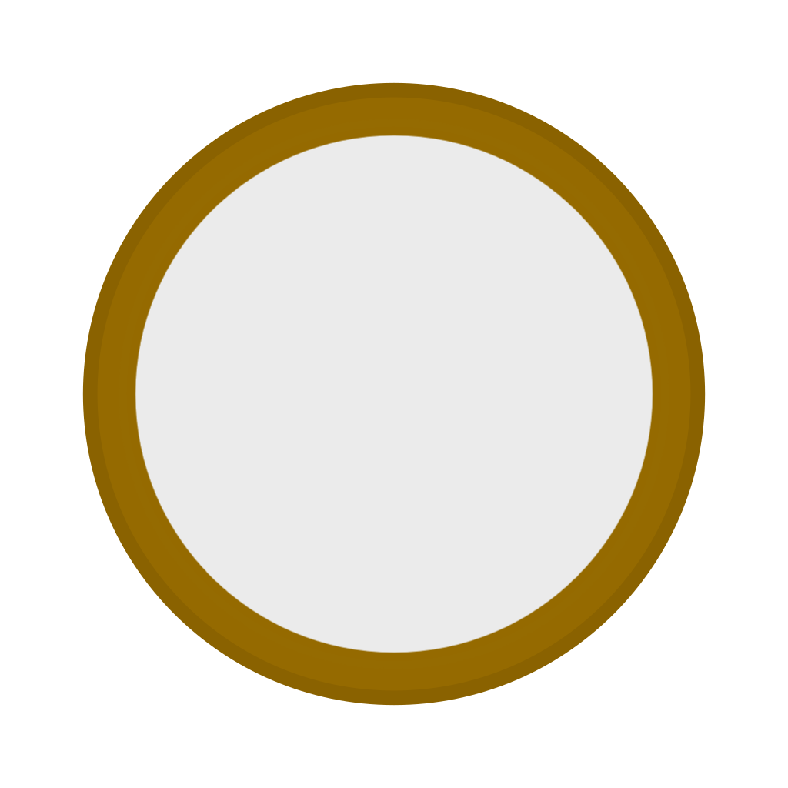

# FileLocker GUI 造型探索——技術規格彙整

這份文件整併了先前三份各自獨立的技術規格文件（信封蠟封、側欄與票根清單、密碼庫筆記本），
原因跟《[GUI造型探索_定案文件.md](GUI造型探索_定案文件.md)》的整併理由一致：探索輪數變多、
互相引用越來越頻繁，分散在多個檔案裡不好找。整併時**只搬動位置、調整標題層級，不刪減任何
內容**——每份原始文件整段搬進對應的大章節，原本的小節結構、程式碼片段、踩坑記錄全部逐字
保留，只有標題層級統一降一級（原本的 `##` 變 `###`，`###` 變 `####`，以此類推），並把跨檔案
的引用改成本文件內的章節連結。

跟《GUI造型探索_定案文件.md》的分工原則不變：那份文件記「決策」本身，這份文件記「具體怎麼
用 CSS/HTML 刻出來的」——確切的座標數字、CSS 決策、每個數字的計算依據，以及過程中踩過的坑
跟為什麼最後選了現在這個做法。

## 目錄

1. [信封蠟封](#1-信封蠟封)
2. [側欄與票根清單](#2-側欄與票根清單)
3. [密碼庫筆記本](#3-密碼庫筆記本)

---

## 1. 信封蠟封

這節記錄 `8-envelope-assembled.html`、`9-envelope-list.html`、`10-vault-door.html`、
`12-file-tab-merged.html` 四個 mockup 目前的實作細節：確切的座標數字、CSS 決策、每個數字的
計算依據，以及過程中踩過的坑跟為什麼最後選了現在這個做法。目的是之後要把這幾個 mockup 移植
回 `App.vue`／拆成 Vue 元件時，照這份文件對照著做，不用重新量測或重新踩一次同樣的坑。

`8-envelope-assembled.html` 目前有四個測試場景：折疊動畫（開⇄闔）、靜態完成畫面對照組、
靜態完成畫面＋文字對照組、三個「寄出」飛走動畫測試（單純飛走／帶文字一起飛走／跳進來→打開→
關起來→往後躺→飛出去的全流程自動播放）。第 1～3 節記的是折疊動畫跟清單列／金庫門，第 4～5 節
記的是「寄出」飛走動畫跟完成畫面文字疊層，第 6 節記的是「檔案」分頁合併排版 mockup。

跟《GUI造型探索_定案文件.md》第 1 節〈信封蠟封方向〉的關係：那節記的是「決策」本身（為什麼
選信封比喻、範圍多大、批次怎麼表現），偏概念層級；這節記的是「這個決策具體怎麼用 CSS/HTML
做出來」，偏實作層級。這節內容有一處跟第 1 節的落差（金庫門鉸鏈方向），見〈1.7 與定案文件的
落差〉。

### 素材共通量測基準

`Envelope_Body.svg` 與 `Envelope_Flap.svg` 的 `viewBox` 都是 `0 0 1024 1024`（正方形）。所有
位置數字都是直接讀 SVG 內部 `<path>` 的原始座標、套用 SVG 自己的 `matrix()` 轉換算出來的，
不是用眼睛在畫面上量的截圖像素。

**`Envelope_Body.svg`（信封本體矩形，套用 `matrix(1.037576,0,0,0.754228,-81.172176,109.534583)`
之後）：**

| 邊界 | 數值（1024 為基準的百分比） |
|---|---|
| 左緣 | 6.985% |
| 右緣 | 93.02% |
| 上緣 | 32.073% |
| 下緣 | 67.94% |

左右邊界剛好對稱（左右各留 6.98% 的邊）。

**`Envelope_Flap.svg`（封口三角形，在它自己的 1024×1024 畫布裡，套用
`matrix(1,0,0,1.643103,-0,-257.712891)` 之後）：**

| 特徵點 | 數值 |
|---|---|
| 尖端（apex） | 27.53%（y 軸） |
| 寬邊／鉸鏈線（wide edge） | 50.0%（y 軸，剛好是畫布正中心） |
| 左右邊界 | 6.985%～93.02%（跟信封本體完全對齊） |

**關鍵結論**：因為封口的寬邊剛好落在它自己畫布的正中心（50%），只要把整個封口圖層往上位移
`50% − 32.073% = 17.927%`，寬邊就會剛好貼齊信封本體的上緣；而且封口的旋轉中心
`transform-origin:50% 50%`（圖片正中心）本來就等於這條寬邊／鉸鏈線，**不需要另外手動找鉸鏈
位置**，也不需要 `transform-origin` 用非中心的百分比去湊。這是這輪最後才確認、比先前版本
簡化很多的做法。

`Envelope_Body.svg` 內部還烤了一個裝飾用的小三角形（信件圖示＋兩條文字剪影線條），是**素材
本身自帶的內容，不是 mockup 程式碼加的**——獨立開啟這個 SVG 檔案本身即可驗證。用同樣的座標
方法量出來，它落在畫布 32.07%～54.54% 之間（y 軸），只有在封口沒有蓋住這塊區域時才看得到
（打開時看得到、闔上時被封口紙蓋住）。

### 1. 加密表單／完成畫面折疊動畫（`8-envelope-assembled.html`）

#### 1.1 容器結構：正方形畫布 + 裁切窗口

**根本問題**：素材的 `viewBox` 是正方形，如果容器不是正方形（例如早期版本用過的 340×230），
`object-fit:contain` 會把圖片裁成置中的正方形去顯示，而如果另一層（封口）又用寫死的像素尺寸
去疊，兩者的縮放基準會對不上，導致封口比例跑掉、邊界對不齊、看起來「炸出去」。**修法是容器
永遠維持正方形**，兩張圖都用 `width:100%;height:100%`（不需要 `object-fit`，因為容器本身
已經是 1:1，不會有形變）。

```
.envelope-outer  { width:320px; height:250px; overflow:hidden; perspective:900px; }
.envelope-canvas { position:absolute; left:0; top:-19px; width:320px; height:320px; }
```

`envelope-canvas` 是真正的正方形畫布（320×320，對應素材的 1024×1024）。`envelope-outer` 是
外層裁切窗口，用 `overflow:hidden` 只露出畫布裡有內容的那一段（信封本體＋封口尖端，上下留一點
呼吸空間），不然正方形畫布會有大片空白（本體只佔畫布中間一段窄的橫帶）。

`top:-19px` 的來源：封口尖端（開啟時）落在畫布 9.60%（＝27.53% − 17.927%，見上面的量測結論）
＝ `0.096 × 320 ≈ 30.7px`，往上留一點邊（不要貼死畫布邊緣）取整為 19px 的裁切偏移。

#### 1.2 圖層結構（DOM 順序＝疊放順序）

```html
<div class="envelope-canvas">
  
  <div class="flap-group">
    <div class="wax-drip-back"></div>  <!-- 背面蠟滴：被紙壓在下面 -->
    
    <div class="wax-seal"></div>        <!-- 正面蠟封：壓在紙上面 -->
  </div>
</div>
```

蠟滴／蠟封都是 `.flap-group` 的**子元素**（不是同層 sibling），用封口紙自己的本地座標定位，
所以會跟著封口紙一起做 3D 旋轉——整個摺疊過程蠟封都黏在封口尖端上，不是動畫播完才瞬間出現在
別的位置（這是使用者明確要求的行為：「應該要跟著可活動三角形一起從上面往下翻轉、蓋到正確的
位置，緊緊粘著可活動三角形的頂點」）。

DOM 順序決定圖層前後：
- `wax-drip-back` 放在 `img.flap` **之前** → 被紙壓在下面（背面蠟滴的邏輯：紙蓋住大部分蠟滴，
  只露出邊緣，象徵蠟滴在紙的背面）
- `wax-seal` 放在 `img.flap` **之後** → 壓在紙上面（正面蠟封蓋章的邏輯：蠟封蓋在封口紙上）

這是使用者明確要求的：「如果現在是蠟封背面的 icon 那他的圖層順序就要在三角形的後面……如果是
正面那就要反過來由蠟封壓住三角形」。

#### 1.3 旋轉角度：0deg（開）／−180deg（闔），不是 −135deg

```css
.flap-group{ transform-origin:50% 50%; transition:transform 420ms var(--ease-inout); }
.envelope-outer.is-open   .flap-group{ transform:rotateX(0deg); }
.envelope-outer.is-closed .flap-group{ transform:rotateX(-180deg); }
```

兩個容易搞錯、已經踩過坑的地方：

1. **封口素材「沒有旋轉」的原始畫法就是打開站立的樣子，不是闔上平躺的樣子**——跟一般直覺
   （0 度＝平躺闔上）相反。這是透過 9 個角度的旋轉掃描測試才確認的，不要憑直覺假設方向。
2. **闔上一定要轉滿 −180deg，−135deg 會蓋不滿**。可動封口跟信封本體上烤進去的那個固定
   三角形裝飾大小完全一樣，只有真的轉滿 180 度、完全貼平原本站立的那個面，兩者的外框投影才會
   重合；轉不到 180 度，因為透視關係（`perspective:900px`），封口在螢幕上的投影會比實際尺寸
   小一圈，看起來蓋不滿、留一圈縫。

#### 1.4 蠟滴／蠟封的定位與淡入淡出時機

```css
.wax-drip-back{ top:27.53%; width:38px; height:38px;
  transition:opacity 30ms linear 195ms; }
.wax-seal{ top:29.5%; width:42px; height:42px;
  transform:translate(-50%,-50%) rotateX(180deg);
  transition:opacity 30ms linear 195ms; }
```

- `top` 用的是封口紙自己的本地座標（因為兩者都是 `.flap-group` 的子元素）：蠟滴貼在
  27.53%（尖端本身），蠟封往下多 2 個百分點（29.5%）——蓋章要落在尖端「再過去一點」的位置，
  貼著尖端但不完全疊在同一點，肉眼看起來才像蓋在紙上而不是疊在紙的邊緣上。這個值经過使用者
  三輪來回微調（33% 太高、27% 太低，最後定在 29.5%）。
  **重要**：因為父層 `.flap-group` 闔上時整層轉了 180 度，`top` 數值變大在「翻轉前」的座標系
  是往下，但翻轉之後在螢幕上看起來反而是往上——調整這個值時方向感是反的，要注意。
- `wax-seal` 額外疊了一個 `rotateX(180deg)`，用來**抵銷父層闔上時的 −180deg 翻轉**——蠟封
  本身要正著看，不能因為跟著封口紙的容器一起翻轉就跟著上下顛倒。這是使用者實測發現的 bug
  （「正面的蠟封 icon 上下放反了」），根源正是子元素會繼承父層的 3D 旋轉。
- **淡入淡出時機延遲到 195ms**（420ms 動畫的接近一半）：那一刻封口紙正好轉到接近側面
  （−90deg 附近），因為 `preserve-3d` 的關係從正面看幾乎是一條線、幾乎看不到內容，這時候切換
  蠟滴／蠟封的可見性才不會被看到「換內容」的瞬間跳動。`transition` 本身故意設得很短（30ms），
  讓它在那個看不到的瞬間直接切換，不是整段旋轉過程中慢慢淡出淡入。195ms 是估計值（沒有精確
  計算這個 `cubic-bezier(0.77,0,0.175,1)` 曲線在哪個時間點正好對應 −90deg 的視覺投影角度），
  如果實際跑起來切換時機還是看得出來，這個延遲值可以再微調。

#### 1.5 表單區塊的位置：避開內建裝飾

```css
.form-zone{ top:158px; }
```

`158px` 不是隨便抓的：信封本體裡烤進去的裝飾三角形佔畫布 32.07%～54.54%（見前面「素材共通
量測基準」），換算成這個容器的座標是 `83.6px ~ 155.5px`，表單直接接在裝飾圖示下面（158px），
避免密碼輸入框／checkbox 跟裝飾圖示疊在一起。這個裝飾圖示只在打開狀態看得到（`.form-zone`
的 `opacity` 也只在打開時是 1），闔上時封口紙會整個蓋住它。

#### 1.6 靜態對照組（`.envelope-closed`）

`.envelope-closed` 區塊是一個**不含任何 JS/class 切換邏輯**的純靜態「已闔上」畫面，數值跟
動畫版的闔上終點狀態完全一致（`top:-19px` 裁切偏移、`rotateX(-180deg)`、蠟封 `top:29.5%` +
`rotateX(180deg)` 抵銷翻轉）。存在的目的是拿來當「這個角度/位置數字組合起來應該長怎樣」的
獨立驗證基準——之前 debug 動畫版本的疑難雜症時，這個對照組因為沒有任何 class 切換/transition
邏輯，是唯一每次都能正確渲染的參照。

### 2. 已加密清單列（`9-envelope-list.html`）

#### 2.1 Grid 欄位結構

```css
.row{ display:grid; grid-template-columns:40px 0 1fr 150px auto; gap:16px; align-items:center; }
```

五欄依序：檔案類型圖示（40px）／撕線（0 寬度，靠 `border-left` 畫出來）／檔名+meta
資訊（`1fr`，吃掉剩餘空間）／郵戳徽章欄位（固定 150px）／操作按鈕欄位（`auto`，但见 2.3，
實際上被 `.actions` 自己的 `width:200px` 鎖死）。

**踩過的坑**：郵戳欄位一開始是放在 `.actions`（按鈕的 flex 容器）裡面當一個 flex item，這樣
一來，這一列有 1 個按鈕還是 2 個按鈕，`.actions` 的總寬度就不一樣，郵戳圖示的水平位置會跟著
按鈕數量飄移（因為 `.actions` 整體靠 grid 的 `1fr` 欄位往右推、`auto` 欄位跟著內容多寡伸縮）。
**修法分兩層**：
1. 郵戳欄位獨立成 `.row` 自己的 grid 欄（`150px`，不嵌在 `.actions` 裡面）。
2. 光這樣還不夠——因為 grid 的 `auto` 欄位（`.actions`）還是會依照按鈕數量伸縮，連帶影響
   1fr 欄位的實際寬度，郵戳欄位的絕對位置仍然會受影響。所以 `.actions` 也要有**固定寬度**
   （見下方 2.3），兩層固定寬度疊加，郵戳徽章的水平位置才真正跟按鈕數量無關。

#### 2.2 郵戳徽章：尺寸與「溢出」定位手法

```css
.postmark-slot{ position:relative; height:36px; }              /* 只佔位，不決定視覺內容 */
.postmark{ position:absolute; left:0; top:50%; width:150px; transform:translateY(-50%);
  display:flex; align-items:center; gap:8px; }
.postmark img{ width:80px; height:80px; object-fit:contain; }
.postmark .pm-text{ font-size:12px; font-weight:800; max-width:58px; }
```

演進過程（每一步都是使用者實測回饋逼出來的）：
1. 最早文字疊在圖示正下方，各自佔一塊獨立空間 → 列高被撐爆、旁邊按鈕被拉伸到跟郵戳徽章一樣高
   （因為 `.actions` 是 flex 容器沒設 `align-items`，預設 `stretch`）。**修法**：`.actions`
   加上 `align-items:center`；文字改成疊在圖示下半部的波浪線裝飾上（不再另外佔空間）。
2. 文字疊在圖示的波浪線上會讀不清楚 → 改成圖示＋文字左右並排（`display:flex`），不再重疊。
3. 圖示放大到 80px 之後，`.postmark-slot` 如果用正常 flow 佔滿 80px 高度，會把整列的 grid
   高度撐開，導致有郵戳徽章的列比其他列明顯高一截。**修法**：`.postmark-slot` 自己的高度故意
   設得很矮（36px，接近按鈕高度），完全不反映圖示的真實尺寸；真正 80px 高的 `.postmark`
   視覺內容改用 `position:absolute` 疊上去、`overflow` 允許蓋過列的上下邊界（`.row` 沒有設
   `overflow:hidden`，所以圖示可以視覺上微微凸出卡片邊緣）。這是使用者明確選定的方案（另一個
   選項是把圖示縮小塞進緊湊列高，使用者選了維持大尺寸＋溢出）。

#### 2.3 按鈕：統一白色、固定寬度靠右對齊

```css
.actions{ display:flex; gap:8px; width:200px; justify-content:flex-end; align-items:center; }
.actions button{ border:1px solid var(--line); background:#fff; color:var(--ink); }
```

**沒有金色實心按鈕**——最早的版本有 `.primary`（金色實心，用在「解密」／「全部解鎖」）跟
白色外框（用在「Passkey」／「恢復金鑰」）兩種樣式，使用者最後決定全部統一成白色，理由是
金色實心按鈕在不同列之間位置忽左忽右（因為當時漏掉幫「密碼管理備份.zip」那一列補上「解密」
按鈕，只單獨放了金色的「恢復金鑰」，造成視覺上顏色跳動），與其持續維護「主要動作永遠是第一個
按鈕」這種容易漏掉的規則，不如整批改成統一色。**如果之後要恢復主次按鈕的視覺區分，記得規則
是：解密／全部解鎖是每一列的主要動作，永遠排最左；Passkey／恢復金鑰是替代解鎖方式，排在
後面。**

`width:200px;justify-content:flex-end` 讓按鈕永遠貼齊欄位右緣，不管這一列是 1 個按鈕還是
2 個——這是 2.1 提到的「郵戳徽章定位」修法的必要前提，不是單純的按鈕美觀選擇。

#### 2.4 頁首蠟封圖示

```css
.page-title img{ width:64px; height:64px; }
```

從最早的 24px（跟文字同一行高的小圖示）放大到 64px。使用者原話「大到可以直接看得清他的細節」
——這個蠟封圖示本身細節很多（雙層蠟紋、鎖頭壓印），24px 完全看不出來是什麼。

### 3. 金庫門動畫（`10-vault-door.html`）

```css
.door{ transform-origin:21% 50%; transition:transform 500ms var(--ease-inout); }
.wheel{ left:50%; top:50%; transform:translate(-50%,-50%) rotateZ(0deg); }
.scene.door-open .door{ transform:rotateY(-70deg); }

@keyframes wheel-spin-open{
  0%{ transform:translate(-50%,-50%) rotateZ(0deg);
      animation-timing-function:cubic-bezier(0.18,0.5,0.32,1); }
  85%{ transform:translate(-50%,-50%) rotateZ(550deg);
       animation-timing-function:cubic-bezier(0.3,0.6,0.5,1); }
  100%{ transform:translate(-50%,-50%) rotateZ(540deg); }
}
@keyframes wheel-spin-close{
  0%{ transform:translate(-50%,-50%) rotateZ(540deg);
      animation-timing-function:cubic-bezier(0.18,0.5,0.32,1); }
  90%{ transform:translate(-50%,-50%) rotateZ(-9deg);
       animation-timing-function:cubic-bezier(0.3,0.6,0.5,1); }
  100%{ transform:translate(-50%,-50%) rotateZ(0deg); }
}
.wheel.spin-open{ animation:wheel-spin-open 650ms both; }
.wheel.spin-close{ animation:wheel-spin-close 780ms both; }
```

- **鉸鏈在左側**（`transform-origin:21%`，門往左邊掀開的視角其實是繞左邊鉸鏈往外轉開）。
  **這跟《GUI造型探索_定案文件.md》第 2 節原本記錄的「鉸鏈定案在右側」不一致**——使用者後來
  重新匯出了 `Vault_Frame.svg`／`Vault_Door_Slab.svg`，把鉸鏈缺口從右側改到左側，程式碼跟著
  更新，但沒有回頭同步那份定案文件（已於整併時同步訂正，見定案文件第 2.2 節）。**這份技術
  規格文件以目前程式碼（左側 21%）為準。**
- 轉輪（`.wheel`）用 `left:50%;top:50%` + `translate(-50%,-50%)` 置中在門體正中央。中途
  重構成「轉盤獨立於 `.scene.is-open/is-closed` 這組 class 切換」的接力時序架構時，一度漏掉
  這條 `translate(-50%,-50%)` 的預設值（改成只在 `.wheel-unlocked` 這個 modifier class 裡才有
  這行位移），造成沒有 modifier class 的預設（關閉）狀態下轉盤完全沒有置中、飄到容器右下角
  ——這個坑後來靠比對使用者截圖跟自己截圖抓出來，教訓是：把「同一個屬性」拆到多個 class
  分別宣告時，要確認「什麼都沒套用」的那個基準狀態本身也有完整、正確的預設值，不能只顧著
  modifier class 彼此之間的差異。
- 開門角度封頂在 −70deg（不是 −90 或更多），避免轉到會露出門背面結構的角度。
- **轉輪跟門扇是接力（不重疊）時序，不是同時觸發**——這是這輪修正過的地方，跟這份文件
  更早版本、以及《GUI造型探索_定案文件.md》最早寫的「兩拍同時觸發、靠 transition 時長
  不同做出先後感」不一樣：截圖走查發現「同時觸發、轉輪較快停」實際播起來像「邊轉邊開」，
  不是「轉開了才打開」。改成 JS 用 `setTimeout` 明確排隊：解鎖時先讓轉輪播 `spin-open`
  這個 CSS animation，等 `WHEEL_OPEN_MS`（650ms，對應 animation 宣告的時長）之後才把
  `door-open` class 加上去讓門開始開（`.door` 自己的 `transition` 500ms）；上鎖反過來，
  先讓門的 `door-open` class 移除（門開始關），等 `DOOR_MS`（500ms，對應 `.door` 的
  transition 時長）之後才讓轉輪播 `spin-close`。兩段動畫本身還是各自獨立的 CSS
  transition/animation，JS 只負責「什麼時候該讓下一段開始」，不是自己算每一幀的角度。

#### 轉輪的「喀」一聲回彈手感

轉盤停到定位時要有機械式的回彈卡住感（呼應定案文件「漸漸變慢＋最後頓一下」的既定決策），
不是線性轉到底就直接停。單一條 `transition` + 單一條 `cubic-bezier` 沒辦法同時做到「起手
不要太快、中段持續減速有重量感、到定位前只回彈一點點、回彈到位時又要瞬間停住」這麼多段落
各自不同的要求，改用 CSS `@keyframes`，把整段動作拆成兩個時間區間、各自指定自己的
`animation-timing-function`：

1. **第一段（0% 到接點）**：轉盤本體，佔掉大部分時間跟圈數，速度連續遞減、做出重量感。
   轉到接點時故意轉過頭（比最終停等角度多轉一點點），這個「過頭的量」就是回彈的量。
2. **第二段（接點到 100%）**：時間短、距離也短，把過頭的量收回來、卡進最終停等角度，
   讀起來像「還有一點點動量，但幾乎立刻被吸收停住」——CSS 曲線本身沒辦法做到真正物理上
   不連續的速度，是靠「這段時間極短＋距離極短」讓眼睛感覺不到還在減速，產生「喀」一聲
   卡住的錯覺。

**調參數的過程踩過幾個坑，記下來避免以後重踩：**

- **keyframe 的接點百分比不能亂挑好看的整數（例如 88%/90%）**——每一條 `cubic-bezier`
  曲線，視覺上「已經到達終點值、完全停住」的時間點是曲線形狀本身決定的固定比例（跟曲線被
  分配到的時間長度無關，bezier 曲線本來就是跟時間尺度無關的），不會剛好等於 keyframe 宣告
  的百分比。如果接點設得比曲線實際跑完的時間晚太多，中間就會空出一段「轉盤已經到定位、
  完全靜止，但還沒到接點觸發最後修正」的空檔，實際播放起來是「轉完－愣住一下－才抖一下
  卡住」，會被感覺成卡頓，不是連續動作。正確做法是先用一個寬裕、比較長的總時長加上偏後的
  接點去實測「這條曲線大概花多少比例的時間視覺上跑完」，再回頭把接點對齊量出來的比例、
  同時把總時長收斂到不留空檔的長度。
- **接點位置同時也決定收尾那一下「乾不乾脆」**——接點到 100% 這段的絕對時長（`(1-接點百分比)
  × 總時長`）如果太長，即使只是修正一個很小的角度，播起來也會覺得軟、不乾脆；上鎖的收尾段
  只有 780ms 的 10%（約 78ms），開鎖第一版把接點設在 67% 時收尾段長達 650ms 的 33%
  （約 214ms，將近上鎖的 3 倍），使用者實際回饋是「開鎖最後那一下感覺軟掉了，不像關閉時
  那樣清脆」。這兩個限制（不能留空檔、收尾不能拖太久）要一起滿足，不是調好其中一個就結束——
  最後把接點從 67% 往後移到 85%（收尾段縮到約 98ms，接近上鎖的 78ms），同時重新實測確認
  接點前依然沒有空檔，兩個問題才算一起解決。
- **想讓某一段曲線「多花一點時間才逼近終點」，直覺會去把控制點 x2 往右推（例如從 0.46 推到
  0.88）**，但實測發現這樣做的實際效果反而是「中段幾乎等速巡航、到最後才忽然驟降」（一種
  聽起來合理、量出來卻不是那麼回事的直覺），不是「持續、平滑地拖久」——播起來像直接衝到底
  撞牆彈回來，不是漸漸慢下來。真正需要的是速度連續遞減（越後面越慢，每個時間點都比前一個
  慢）的曲線形狀，不是「維持高速久一點、最後才煞車」的形狀。最後解法是直接沿用上鎖那條已經
  驗證過手感是對的曲線 `cubic-bezier(0.18,0.5,0.32,1)`，開鎖跟上鎖的手感區隔改成靠「接點
  位置」跟「總時長／轉的圈數」維持，不是靠曲線形狀本身的差異。
- 開鎖的最終停等角度是 540deg（`360+180`，多轉 1 圈），上鎖回到 0deg——兩者 `mod 360`
  都落在 90° 的整數倍（0° 跟 180°），因為轉盤本體是四個握把、四等分的造型，停在任意角度
  握把跟外殼的相對位置會歪掉，只有 90° 的倍數能保證每次停下來造型都是正的。

#### 轉盤「軸心偏一邊」的排查記錄（`11-wheel-wobble-test.html`）

使用者反映轉盤轉動時**主觀感覺**軸心偏某一邊，不像是繞正中心轉。這輪逐一排查了每個可能的
環節，**最終結論是排除了所有實際的程式/素材缺陷，判斷是視覺錯覺，不是 bug**——完整記錄
排查過程，避免以後同一個疑慮又要重新查一次：

1. **CSS 旋轉軸心算錯？**——排除。用 `getBoundingClientRect()` 在多個旋轉角度下量測
   `.wheel` 容器跟裡面 `` 的中心點座標，結果在所有角度下都精準落在同一點
   （`transform-origin` 算出來的值），沒有任何偏移。
2. **`.wheel` 容器不是正方形（因為父層 `.door` 是 320×280 的長方形，`width:34%;height:34%`
   套用到非正方形容器上會變成長方形），會不會讓 `object-fit:contain` 沒對齊？**——排除。
   在跟真實頁面完全相同尺寸（108.8×95.2px）的獨立長方形容器裡單獨測試，`object-fit:contain`
   仍然把圖片準確置中在容器幾何中心，跟容器是不是正方形無關。
3. **SVG 素材本身內容沒有置中在自己的 viewBox 裡？**——排除。素材檔的向量座標本身就是
   `cx="512" cy="512"`，跟 1024×1024 viewBox 的正中心完全對齊；後續使用者自己也拿匯出的
   PNG 在圖片檢視軟體裡手動旋轉比對，任何角度看起來都一樣，不是素材本身歪斜。
4. **素材曾經帶有方向性的立體陰影（模擬固定光源），會不會是陰影跟著圖案一起轉、造成
   「軸心跟著陰影感覺跑掉」的錯覺？**——這是排查中間一度認為最可能的解釋（陰影方向固定
   在圖片的點陣資料裡，整張圖旋轉時陰影會跟著轉，破壞「光源固定、物體在轉」的物理直覺），
   但使用者把素材改成完全平面、無方向性陰影/亮光的版本後，回報問題依然存在——**這個理論
   被使用者自己的測試推翻，不是真正原因**。
5. **四根主輻條的實際渲染寬度是不是不一致？**——排除。直接對渲染完成的畫面做逐像素掃描
   （在畫面正中心分別做水平跟垂直掃描線，量金色像素的連續長度），四根輻條量出來都是
   82px，完全相等，不是「差不多」是精確相等。使用者一開始懷疑的「一寬一窄」，比對後
   確認是疊加的紅色十字參考線在跟輻條交叉處造成的視覺對比錯覺（色塊交界處的常見錯覺），
   不是輻條本身寬度不同。
6. **Windows 檔案總管裡 `.af` 原始檔跟 `.svg` 匯出檔的縮圖比對，看起來輻條粗細不同？**
   ——不是有效的比對方式，予以排除。两個縮圖是完全不同的渲染引擎產生的（`.af` 靠 Affinity
   Designer 自己的縮圖產生器，`.svg` 靠 Windows 內建的 SVG 縮圖處理常式），各自的留白／
   縮放比例不同，縮圖本身解析度又低，容易在降採樣時產生鋸齒或粗細不均的假象，不能拿來
   判斷實際渲染結果。真正有效的比對基準是用瀏覽器引擎（Chromium，跟正式 App 的 WebView2
   同一套排版核心）實際渲染出來的畫面，而不是縮圖。
7. **動畫播放中某一瞬間的畫面本身有形變/模糊？**——排除。在 `spin-open` 這條實際會用到的
   曲線播放過程中，於多個時間點各自截圖檢查，每一幀本身都是乾淨銳利的，沒有模糊或形變
   （截圖是抓取單一瞬間的畫面，不會有真實顯示器動態模糊那種效果，如果幀本身有問題應該
   截得出來，但沒有）。

**排查完畢後的結論**：資產、CSS 軸心、輻條寬度、動畫幀本身都驗證過沒有實際缺陷。剩下最
符合「動起來才有感覺、感覺是忽快忽慢那段造成的」這兩個線索的解釋，是人眼追蹤一個有旋轉
對稱性（這顆轉盤是 8 等分對稱）、又用非等速（先加速、中段減速、到底回彈）的方式旋轉的
圖案時，本身就容易產生「感覺歪一邊」的錯覺——這是視覺感知的已知現象，不是畫面或程式碼
有缺陷。`11-wheel-wobble-test.html` 留著兩組對照（等速 vs 實際曲線），如果之後想更嚴謹地
驗證這個結論，或想試試看放緩速度曲線的變化幅度會不會降低這種錯覺，可以從這個測試頁繼續。

### 4. 「寄出」飛走動畫（`8-envelope-assembled.html` 測試 1／2／3）

對應《GUI造型探索_定案文件.md》第 1.8 節〈「寄出」動畫與加密交易模型〉，這節記的是實作出來
的確切 CSS／JS，跟定案文件的差別是：定案文件只定了「往前傾斜、往深處飛走」的動態概念，沒有
定案精確角度／距離／時長；這裡記的是實測出來、目前用在測試頁的具體數字。

#### 4.1 結構：`.mailaway-rig` 包在既有 `.envelope-outer` 外面

```html
<div class="envelope-outer mailaway-outer is-closed">
  <div class="mailaway-rig">
    <div class="envelope-canvas">
      
      <div class="flap-group">...</div>
      <div class="mail-filename">...</div>   <!-- 只有「測試3」這個場景才有 -->
      <div class="mail-postmark">...</div>   <!-- 只有「測試3」這個場景才有 -->
    </div>
  </div>
</div>
```

`.mailaway-rig` 是折疊動畫（`.flap-group` 旋轉）之外**另一層**、專門負責「這封信在畫面上的
整體位置／傾斜／遠近」的容器，兩層各自獨立的 transform 互不覆蓋，可以疊起來播放。容器
（`.mailaway-outer`，實際上是疊加在 `.envelope-outer` 上的第二個 class）比折疊動畫用的
`.envelope-outer` 多兩個覆蓋：

```css
.mailaway-outer{ overflow:visible; height:300px; perspective:3200px; }
.mailaway-rig{ position:absolute; inset:0; transform-origin:50% 50%;
  transform-style:preserve-3d; will-change:rotate,translate,filter,opacity; }
```

- `overflow:visible`（覆蓋掉折疊動畫用的 `overflow:hidden`）——飛走動畫需要飛出容器範圍，
  裁掉的話動畫播到後段會被邊界硬生生切掉。
- `perspective:3200px`（比折疊動畫用的 900px 大很多）——見 4.3「飄移幅度」那段的說明。
- `transform-origin:50% 50%`（正中心，不是下緣）——見 4.3。

**測試 3**（`.mail-filename`／`.mail-postmark` 直接放進同一個 `.envelope-canvas` 裡）驗證的
是「文字疊層要跟著信封本體一起飛走，不需要另外寫同步動畫邏輯」——因為它們是 `.mailaway-rig`
的後代元素，會自動跟著同一個 rig 的 `rotate`／`translate`／`filter`／`opacity` 一起變化。

#### 4.2 傾倒方向：`rotate:x` 用正值（下緣近、上緣遠）

```css
.mailaway-rig.is-flying{ rotate:x 35deg; }
```

這裡有兩輪方向修正，都是使用者用手繪透視稿／文字描述糾正出來的，記錄下來避免以後改回錯的：

1. **第一版**（已廢棄）：`rotateX(-26deg)` 疊加 `translateY`／`scale`，效果是信封「躺平朝
   螢幕深處倒」，被使用者指出「躺的方向錯了」。
2. **第二版**（已廢棄）：改用「scale 往一個畫面外的消失點縮小」（不旋轉，單純沿透視線
   往上飛走），使用者一度確認可用，但後來提出更精確的需求——要看得出信封本身在「躺下」，
   不是均勻縮小。
3. **第三版（目前版本）**：真的用 3D 旋轉躺下＋沿 Z 軸送往深處，讓瀏覽器算出真正的透視
   縮小／收斂效果。旋轉方向的判斷依據是使用者的描述「上邊往我的面前的方向倒」＋「像是把
   信往前遞的那種感覺」，具體展開成「從上下等寬變成上窄下寬」——`transform-origin` 在
   正中心，`rotate:x` 用**正值**：CSS 規格裡 `rotateX` 正角度會讓正 Y（下半部，因為 CSS
   的 Y 軸往下）的點往 +Z（鏡頭方向）轉，所以正值＝**下緣往鏡頭靠近（顯得比較寬）、上緣
   往深處退（顯得比較窄）**，符合「上窄下寬」。最早疊試過負值，做出來是反的（上寬下窄），
   是明確的方向錯誤，不是美感選擇。

#### 4.3 `transform-origin` 選正中心：飄移幅度的教訓

一開始想用 `transform-origin:50% 100%`（下緣），理由是比較貼近「一張卡片往你面前倒下、
下緣是支點」的實體直覺。但實測發現：**`rotateX` 疊加大量 `translateZ` 時，把旋轉支點放在
偏離中心的位置，會讓整個物件在畫面上的「投影位置」劇烈飄移**——用 Playwright 量過
bounding box，飄移幅度可以到幾百 px，甚至飄到疊在別的測試區塊上面。這是 3D 投影＋離軸
旋轉支點疊加的正常數學結果（旋轉支點偏移量本身也會被一起旋轉／投影），不是瀏覽器 bug，
但視覺上完全不可控，跟角度/距離也不是線性關係（角度、距離一起放大，飄移量是加速放大，
不是等比放大）。

改用 `transform-origin:50% 50%`（正中心）之後飄移幅度小很多、可預期，這是**實測比對過
`50% 100%` 跟 `50% 50%` 兩版的 bounding box 數字**後選的，不是憑感覺猜的。`perspective`
也從最初的 900px（沿用折疊動畫的值）一路調到 3200px——perspective 值越大，投影變化越
「平緩」，同樣的旋轉／位移產生的飄移量越小，這也是實測比對出來的，不是隨便選一個大數字。

#### 4.4 兩階段時序：先倒下、倒完才飛遠

```css
.mailaway-rig.is-flying{
  transition:
    rotate 260ms var(--ease-out),
    translate 500ms var(--ease-inout) 220ms,
    filter 340ms linear 380ms,
    opacity 520ms linear 240ms;
  rotate:x 35deg;
  translate:0 -130px -260px;
  filter:blur(7px);
  opacity:0;
}
```

**關鍵決定：旋轉／位移改用獨立的 `rotate` / `translate` CSS 屬性，不是塞進同一個
`transform:rotateX(...) translateZ(...)`。** 這兩個是跟 `transform` 平行、各自獨立的屬性
（現代瀏覽器支援），各自可以設定自己的 `transition-duration`／`transition-delay`。如果全部
塞進同一個 `transform`，瀏覽器只會把整串值當一個整體去內插，角度跟距離只能同進同出、沒辦法
分先後——這正是「傾倒跟飛遠感覺黏在一起、模糊也跟著太早開始」這個問題的根本原因，不是把
數字調一調就能解決的，一定要換屬性才能真正分階段。

四個屬性各自的時間軸（使用者原話：「傾倒了－沿著透視線跑，順便淡出、模糊」，順序不能反）：

| 屬性 | 時長 | 延遲 | 說明 |
|---|---|---|---|
| `rotate` | 260ms | 0ms | 第一個動，先把信封倒下去 |
| `translate` | 500ms | 220ms | 跟 rotate 有一點點重疊銜接（不是斷開再開始），倒下收尾的同時開始往深處滑、往上帶 |
| `filter`（模糊） | 340ms | 380ms | 更晚才開始，讓「倒下」這個動作先被看清楚，糊化留給收尾 |
| `opacity`（淡出） | 520ms | 240ms | 跟 translate 差不多時間開始淡出 |

`translate:0 -130px -260px` 的三個分量：X 不動、Y 是 `-130px`（往上，見 4.5）、Z 是
`-260px`（往深處退，數值沿用「飄移幅度可控」那版實測值）。

#### 4.5 往上的動能：`translate` 疊加 Y 分量

第一版只有 Z 軸退遠＋縮小，使用者回饋「只有往前縮小而已，要讓他帶一點往上的動能」——單純
縮小＋退遠看起來像「原地縮小」，缺了「飛」該有的動能感。修法是在 `translate` 疊加一個
Y 軸負值（`-130px`），讓它退遠的同時也往上飄，跟現實中往前遞出去的東西自然會帶一點上揚
弧度是同一個直覺。這個 Y 位移只作用在 4.4 的「階段二」（跟 Z 軸同一個 `translate` 屬性、
同一段 transition），不是獨立的第三階段。

#### 4.6 已知限制／待確認

- 角度（35deg）、距離（`-260px`／`-130px`）、`perspective`（3200px）、四段 transition 的
  時長/延遲，全部是這輪測試調出來的參考值，**定案文件明確寫這些沒有定案精確數字**，之後
  要跟真實動畫（尤其是搭配真實檔案大小、真實 UI 佈局）對照時，大機率還要再調。
- `mail-drop-bounce` 的彈簧參數（阻尼／初速／超過幅度）同樣是測試參考值，定案文件也明確
  標記「沒有定案數值，只定了概念」。
- 這幾個 `.mailaway-rig` 場景目前彼此獨立（`flyOnlyRig`／`flyTextRig`／`fullRig` 各自一份
  重複的 HTML／CSS class），還沒有抽成可重用的元件——移植進 Vue 時應該要抽成一個
  `<MailAwayEnvelope>` 之類的元件，不要照抄三份重複結構。

### 5. 完成畫面文字疊層（檔名／郵戳／加密時間）

對應定案文件裡「闔上後的郵戳徽章內容——郵戳下方要顯示加密時間」跟「檔名下方接日期/大小」
這兩條。這裡的「郵戳」**不是**信封蠟封本身（蠟封在這個比喻裡固定不動、維持在信封正中央），
是重用 `Postmark_Nested_Lock.svg`（鎖頭＋放射狀郵戳線，本來就是為了這個比喻另外畫的素材）
疊在旁邊，跟蠟封是兩個獨立的視覺元素。

#### 5.1 排版：檔名藥丸／方框在左，郵戳＋時間在右，蠟封留在正中央

```css
.mail-filename{
  position:absolute; left:11%; top:58%; transform:translateY(-50%);
  background:#fffaf0; border:1px solid var(--brass); border-radius:3px;
  padding:1.5px 5px 2.5px; font-size:7.5px; font-weight:600; color:#6b5527;
  white-space:nowrap; max-width:26%; overflow:hidden; text-overflow:ellipsis;
  box-shadow:0 1px 2px rgba(0,0,0,.06);
}
.mail-postmark{
  position:absolute; right:25%; top:58%; transform:translateY(-50%);
  width:64px; height:64px;
}
.mail-postmark img{ position:absolute; inset:0; width:100%; height:100%; object-fit:contain; }
.mail-postmark .mail-timestamp{
  position:absolute; left:68%; top:59%;
  font-size:6px; font-weight:700; letter-spacing:-0.3px; color:#8a6a1f;
  white-space:nowrap; font-variant-numeric:tabular-nums;
}
```

這組排版經過至少七輪使用者截圖回饋才定案，中間換過幾次完全不同的方向，記錄如下，避免
之後又走回已經被推翻的版本：

1. **第一版**：檔名疊蠟封正上方、時間疊蠟封正下方，兩者置中對齊在蠟封的垂直軸線上。
   使用者給了一張手繪參考圖，要求改成左右並排（檔名在左、郵戳在右）、蠟封維持在中間，
   不是上下堆疊。
2. **第二版**：改成左右並排，但檔名框是藥丸形、時間文字是郵戳圖示旁邊的獨立文字（不疊在
   圖示上）。使用者要求兩處都要改：檔名框要改成方形＋極小圓角（不要藥丸型），時間文字要
   疊進郵戳圖示「裡面」、放射狀線條下方（不是圖示旁邊另外貼一行字），且檔名位置要比蠟封
   稍低一點。
3. **第三版**：照上面的要求改完，但時間文字置中對齊整個郵戳圖示的寬度，結果有一半疊到
   鎖頭上面，且郵戳整組太貼右邊緣、時間文字有溢出。使用者要求：郵戳要往左移、時間文字要
   對齊「郵戳線」（不是鎖頭）那一段範圍——截圖放大量出鎖頭圓圈跟郵戳線各自落在容器裡的
   實際範圍後，把時間文字改成對齊郵戳線範圍的左三分之一處（不是置中），且時間文字的
   `left` 定位拿掉了置中用的 `transform:translateX(-50%)`，改成單純用 `left` 對齊文字
   最左邊。
4. **第四版**：郵戳整組（含時間）再往左、往下移一次（`right` 19%→25%、`top` 52.6%→58%，
   不再跟蠟封同一條水平線），檔名框也跟著往上收一點、寬度／字級一起縮小到不會碰到蠟封
   左緣（見 5.3）。

#### 5.2 郵戳圖示的「畫布留白」問題：精算裁切窗失敗，退回 `object-fit:contain`

`Postmark_Nested_Lock.svg` 的 `viewBox` 是 1024×1024，但實際畫的內容（雙圈圓框＋鎖頭＋
放射狀郵戳線）只佔畫布裡一小塊，不是滿版——跟 notebook 分類標籤那批素材是同一種情況（見
〈3. 密碼庫筆記本〉的裁切窗算法）。

**這次先嘗試用同一套「精算裁切窗」算法**：用 Playwright 對著獨立開啟的 SVG 檔案跑
`getBBox()`+`getCTM()` 去量內容的實際邊界，算出縮放倍率跟負值偏移，想讓內容撐滿一個小
容器、不留白邊。**這次沒有成功**——量出來的數字套上去之後內容整個跑出容器外（懷疑是
`getCTM()` 在「獨立開啟 SVG 檔案」這個情境下量到的不是預期的座標系，跟量測 notebook 標籤
時用的是「內嵌在完整頁面裡的 SVG」情境不一樣，兩者可能有差異，但沒有查清楚根本原因），
花了不少時間排查後決定放棄精算，**退回較保守的做法**：整張圖直接用 `object-fit:contain`
完整顯示（不裁切、不放大），容器本身放大到 64px 讓內容視覺上看起來夠大。時間文字的位置
（見上面 5.1 第三版）也是**用截圖實測量出來的百分比**，不是靠 SVG 座標公式推算的。

**如果之後要做「裁切填滿、不留白邊」的更精緻版本**，這裡還沒有做到，需要另外找時間排查
`getCTM()` 在獨立 SVG 檔案情境下的量測問題，或者換一種量測方式（例如直接把 SVG 內嵌進
一個測試頁面再量，而不是獨立開啟 SVG 檔案本身）。

#### 5.3 防止疊到蠟封：關鍵是寬度，不是高度錯開

蠟封固定在畫布正中央、寬 42px（畫布寬度 320px 的 13.1%），水平方向佔了畫布中央
43.4%~56.6%（置中對稱）。檔名框跟郵戳現在改成跟蠟封「同一個 top」（`top:58%`，比蠟封
自己的 52.6% 略低，但跟郵戳同高），這代表檔名框／郵戳的垂直範圍勢必會跟蠟封的垂直範圍
重疊——**真正防止視覺上疊到蠟封的關鍵是水平方向的寬度，不是把高度錯開**：

- 檔名框：`left:11%`、`max-width:26%`，右緣落在 `11%+26%=37%`，離蠟封左緣（43.4%）還留
  `6.4%` 的空隙。
- 郵戳：`right:25%`，左緣落在 `75%-64px 換算成 % ≈ 55%`，離蠟封右緣（56.6%）很接近但沒有
  重疊（因為郵戳圖示本身在 64px 容器裡又有留白，實際可見的圓圈內容還要再往容器內縮一點，
  見 5.2）。

檔名框字級跟 padding 也跟著縮小（`font-size` 從最早的 10.5px 一路縮到 7.5px，padding 從
`3px 8px` 縮到 `1.5px 5px 2.5px`）——縮小後意外的好處是完整檔名「專案合約書_最終版.pdf」
反而放得下、不用再靠 `text-overflow:ellipsis` 裁成刪節號（早幾輪 `max-width` 較大但字級也
較大時，完整檔名反而會被裁掉）。

`padding:1.5px 5px 2.5px`（上下不對稱：上面 1.5px、下面 2.5px）是刻意的，不是筆誤——CJK
字形的實際墨色範圍在 em 框裡偏下，用完全對稱的 padding 撐置中，肉眼看文字還是會覺得偏下
一點，用不對稱的 padding（上面留少一點）把文字整體往上頂一點，抵銷這個視覺偏差。這個值
來回調過兩輪（先試 `1px/3px` 太過頭、文字頂太上面，才回調到 `1.5px/2.5px`）。

#### 5.4 時間文字字級：測試瀏覽器的「最小字級」設定是視覺假象，不是真實限制

過程中有一輪誤會，記錄下來避免以後又卡在同樣的地方：使用者的瀏覽器（Brave）設定了
「最小字級 10px」，把 `.mail-timestamp` 的 `font-size` 從 6px 一路調到更小（4.6px／
3.8px）時，使用者那邊完全看不出變化——因為瀏覽器把任何小於 10px 的字級都強制拉回 10px
顯示，不是 CSS 沒生效。**這只是這台測試機器上瀏覽器的個人偏好設定，FileLocker.App
實際使用的 WebView2 是獨立的 Chromium 執行環境，不會繼承使用者個人 Brave 上的這個
偏好設定**，所以設計時不需要遷就 10px 這個下限。目前定案的 6px 是使用者在確認過「這是
測試瀏覽器限制、不是最終畫面」之後，直接指定「從 10px 往下調」得到的結果，不是靠精算。

#### 5.5 已知限制／待確認

- 5.2 提到的裁切窗精算失敗、退回 `object-fit:contain` 的做法——不是最終形態，之後有時間
  應該回頭把這個做正確（郵戳圖示填滿容器、不留白邊），現在的版本圖示看起來偏小、四周留白
  偏多。
- 這組文字疊層目前只在 `8-envelope-assembled.html` 的靜態對照組跟測試 3（飛走動畫）出現，
  折疊動畫本身（測試 0）跟全流程自動播放（測試 2）都還沒有接上這組文字——全流程播放到
  「闔上」那一步時，畫面上只有蠟封，沒有檔名／郵戳／時間，跟定案文件描述的「闔上後顯示
  檔名+郵戳」有落差，需要之後補上。
- 範例檔名跟時間戳記（`專案合約書_最終版.pdf`／`2026-08-16 14:32`）是寫死在 HTML 裡的
  測試資料，之後接 Vue 元件時要換成真正的 props/資料綁定。

### 6. 「檔案」分頁合併 mockup（`12-file-tab-merged.html`）

對應定案文件〈加密／解密／清單合併為單一「加密」分頁〉那節。這份 mockup 驗證「清單為預設
畫面＋兩顆動作按鈕」這個結構，不是驗證信封動畫本身（動畫細節仍以 `8-envelope-assembled.html`
為準）。

#### 6.1 結構總覽

```html
<div class="toolbar">
  <button id="openAddFile">＋ 新增檔案</button>
  <button id="openDecryptExternal">選擇要解密的檔案</button>
</div>
<div class="list">...（清單列，重用 9-envelope-list.html 的樣式）...</div>

<div class="overlay" id="addFileOverlay">      <!-- 新增檔案：信封彈出 -->
  <div class="envelope-outer">
    <div class="envelope-canvas">
      
      <div class="flap-group">...</div>
      <div class="dropzone" id="dropzone">
        <p>拖曳檔案，或</p>
        <button id="fakePickBtn">選擇檔案</button>
      </div>
    </div>
    <div class="sheet">                         <!-- 溢出信封輪廓外的內容，見 6.3 -->
      <div id="pickedWrap">
        <div class="picked-list-frame"><ul class="picked-list" id="pickedList"></ul></div>
        <button id="fakePickBtnMore">＋ 繼續新增</button>
      </div>
      <div class="add-file-actions">
        <button id="addFileCancel">取消</button>
        <button id="addFileNext">下一步</button>
      </div>
    </div>
  </div>
</div>

<div class="overlay" id="decryptExternalOverlay">  <!-- 選擇要解密的檔案：純表單，不套信封 -->
  <div class="plain-dialog">...</div>
</div>
```

`.dropzone` 跟 `.sheet` 都是 `.envelope-canvas`／`.envelope-outer` 的直接子元素，不是巢狀
包在一起的 flex column——這是這輪改版才調整的結構（最早版本是一整條 flex column，見 6.2）。

#### 6.2 選檔案內容在信封裡的定位：兩輪誤判才找對地方

信封本身有**兩個視覺上都像三角形的區域**，容易搞混，這裡明確記錄量測結果，之後不要重新猜：

1. **封口三角形**——`Envelope_Flap.svg` 那層，折疊動畫裡會旋轉的可動零件，頂點在畫布 9.6%、
   寬邊／摺線在 32.07%（量測依據見檔案開頭）。這個 mockup 沒有做折疊動畫（信封本來就是打開
   狀態），封口紙是靜止的，但形狀還在。
2. **裝飾三角形**——`Envelope_Body.svg` 本體圖檔裡**烤進去的內容**（信件圖示＋線條），量測
   落在畫布 32.07%~54.54% 之間，是完全獨立於封口紙之外的另一塊區域，在本體矩形的上半段。

第一輪把 dropzone 內容放進了封口三角形，被使用者糾正「不是啦我指的是下面那個三角形」，才
確認使用者指的其實是裝飾三角形。定案結果：

```css
.dropzone p{position:absolute;left:50%;top:44%;transform:translate(-50%,-50%);}   /* 裝飾三角形正中間 */
.dropzone .btn{position:absolute;left:50%;top:60%;transform:translate(-50%,-50%);} /* 裝飾三角形偏下緣 */
```

過程中還踩過一個量測誤差：一開始以為 `.wax-drip-back`（`top:27.53%`）落在封口三角形的
「中段」，把 dropzone 塞進蠟滴「上面」的窄縫，結果內容整個貼到信封最頂端、蓋住蠟封。後來
才發現 `top:27.53%` 是相對於 `.flap-group` 自己的座標系（`.flap-group` 本身又有
`top:-17.927%` 的位移），換算成相對畫布的實際位置後，蠟滴其實貼在三角形**頂點附近**（約
4.3%~14.9%），不是中段——這個誤差後來被「移到裝飾三角形」這個修正整個取代掉了，但誤差本身
（*子元素的 CSS 百分比是相對父層座標系，父層有位移時不能直接拿子層的數字去套外層座標*）
是通用教訓，記錄下來。

#### 6.3 `.sheet`：溢出信封輪廓外的內容怎麼收尾

`.envelope-canvas` 的可視信封輪廓只到畫布 67.94%，但 `.envelope-canvas` 這個盒子本身是滿版
420px 高（素材「畫布留白」的老問題，見檔案開頭量測筆記）。已選檔案清單＋取消/下一步按鈕
這段內容，實測發現無論信封整體放多大，可視範圍都是同一個比例，塞不進去（放大信封不會生出
「相對空間」，內容需要的高度是絕對值）。

最終定案：這段內容不強塞進信封輪廓內，獨立成 `.sheet`，用信封同色系紙色＋陰影，讀起來像
「從信封裡抽出來、攤在信封前面的一張紙」：

```css
.sheet{
  position:relative;              /* 見 6.4 的層疊坑 */
  width:fit-content;              /* 貼合內容寬度，不是撐滿 420px（見 6.5） */
  margin:-123px auto 0;           /* 拉近跟信封的距離，見下方公式 */
  background:var(--paper);
  border-radius:9px;
  box-shadow:0 4px 10px rgba(58,51,31,.12);  /* 刻意調淺調短，見 6.6 */
  padding:9px 12px 10px;
}
```

`margin-top:-123px` 的算法：`.envelope-canvas` 高度 420px（canvas）− 67.94%×420px（信封
可視下緣，≈285px）− 12px（想要的呼吸空間）≈ 123px。這個數字只對這個 mockup 目前的
420px 畫布尺寸有效，改了信封整體大小要重新算。

> **待實作（第 5 節加密流程接入側欄殼子那輪定案）**：`.sheet` 目前是瞬間出現、沒有進場
> 過渡動畫，定案文件第 5.2 節已經定案要補上「兩段式」進場動畫（先從信封底下滑出露出全貌，
> 再往上收回疊進信封可視範圍），這節記的是現況（尚未套用新動畫前）的靜態定位方式，套用
> 進場動畫時這些定位數字（尤其 `margin-top:-123px`）會是動畫終點的座標，不是要整個推翻
> 重算。

#### 6.4 層疊順序坑：`position:relative` 的元素會蓋過沒有定位的元素

`.sheet` 用負 margin 拉近後會跟 `.envelope-canvas` 的透明留白區視覺重疊。`.envelope-canvas`
有 `position:relative`，`.sheet` 原本沒有設定位——CSS 規則是「有定位（哪怕只是
`position:relative`、沒設 `z-index`）的元素，預設會蓋過沒有定位的一般元素，不管 DOM 順序
誰在後面」。結果是 `.envelope-canvas` 蓋住了 `.sheet`，擋住裡面按鈕的點擊事件（Playwright
測試直接跳出 `intercepts pointer events` 的錯誤，不是肉眼看出來的）。

修法：`.sheet` 也給 `position:relative`，兩者都進入同一個層疊順序比較基準，才會照 DOM
順序（`.sheet` 在後面）疊在上面。**這個坑的教訓**：一旦某個元素要跟一個「有定位」的元素
重疊，這個元素自己也要給定位，不能假設「我在 DOM 後面就會蓋在上面」。

#### 6.5 `.sheet` 寬度：從撐滿 420px 到貼合內容

演進過程：

1. 最早 `.sheet{width:100%}`（相對 `.add-file-body` 的 `left:9%;right:9%`）——按鈕
   `justify-content:space-between` 撐到卡片兩端，中間留一大塊死白。
2. 改 `justify-content:flex-end`——按鈕拉近了，但卡片本身還是撐滿寬度，左半邊還是死白，
   使用者吐槽「當然不是這麼簡單擠到右邊而已」。
3. 改 `justify-content:center` ＋ `.sheet{width:fit-content}`——卡片寬度貼合內容，只有
   按鈕時卡片很窄，有清單時卡片跟著清單寬度撐開。這是目前定案的版本。

`.picked-list` 因為需要固定寬度（見 6.6），不能沿用父層的 `fit-content`（不然每一列會各自
縮到自己檔名的寬度，長短不一時參差不齊）——`.picked-list{width:268px}` 自己給一個固定寬度，
`.sheet` 的 `fit-content` 會照這個寬度撐開。

#### 6.6 已選檔案清單：固定高度＋獨立外框

```css
.picked-list-frame{border:1px solid var(--line);border-radius:8px;padding:6px;background:#fdfcf7;}
.picked-list{width:268px;height:112px;overflow-y:auto;}  /* 固定 height，不是 max-height */
```

兩個決定：

- **固定 `height`（不是 `max-height`）**：原本用 `max-height:150px`，1 筆檔案時清單很矮、
  底下的「＋ 繼續新增」連結跟著往上貼；改成固定 `height`，1 筆跟 5 筆佔的高度完全一樣，
  下面的連結／按鈕位置不會因為清單筆數變動而跟著移動，只有清單自己內部捲動。用 Playwright
  量過：1 筆跟 4 筆檔案時「＋ 繼續新增」連結的 `boundingBox()` y 座標數字一模一樣。
- **`.picked-list-frame` 獨立外框**：把「會捲動的清單範圍」跟「清單外面固定不動的內容
  （繼續新增連結、取消/下一步按鈕）」用邊框明確隔開，原本兩者黏在一起沒有邊界，看不出來
  哪塊會捲動。

高度數字（112px）也是刻意縮小過的——原本 150px 在只有 1 筆檔案時空白太多，使用者要求
「初始的空間減少一點」，改成 112px（約 3 行多一點）。

#### 6.7 整層彈窗的垂直對齊：置中會導致信封跟著清單長度漂移

`.overlay` 原本共用 `align-items:center;justify-content:center`，清單筆數增加時
`.envelope-outer` 整體高度跟著變，flex 置中重新計算，連信封本體都會跟著往上跳，不是只有
清單自己變長。修法：`#addFileOverlay` 單獨覆蓋成固定頂部對齊：

```css
#addFileOverlay{align-items:flex-start;padding-top:70px;}
```

只覆蓋這一個 overlay，「選擇要解密的檔案」那個純表單彈窗（`#decryptExternalOverlay`）高度
本來就不會變，不受這個問題影響，維持原本 `.overlay` 的置中設定，沒有跟著改。

驗證方式：用 `boundingBox()` 量 `.envelope-canvas` 在加檔案前後的座標，確認 x/y 完全沒變
（不是肉眼看大概沒動，是數字比對）。

#### 6.8 四級信封圖示，跟拖曳懸停預覽

信封本體圖示依「選了幾個檔案」分四級，不是原本設想的「空/有東西」二選一——`Envelope_Body_Empty.svg`
（0）／`Envelope_Body_One.svg`（1）／`Envelope_Body_Two.svg`（2）／`Envelope_Body.svg`（3
以上封頂，重用既有素材不用重畫）。四張圖除了裡面裝飾圖示的內容不一樣之外完全同尺寸同座標，
所以切換只需要換 `img.src`，不用調整任何位置：

```js
function bodyImgFor(count){
  if (count <= 0) return '../../assets/Envelope_Body_Empty.svg';
  if (count === 1) return '../../assets/Envelope_Body_One.svg';
  if (count === 2) return '../../assets/Envelope_Body_Two.svg';
  return '../../assets/Envelope_Body.svg';   // 3 個以上都封頂用這張
}

function render(){
  const count = pickedList.children.length;
  bodyImg.src = bodyImgFor(count);
  // ...disabled/dropzone 顯示切換略
}
```

拖曳懸停在信封上時（見定案文件〈選檔案步驟的信封排版〉），這個 mockup 用滑鼠
`mouseenter`/`mouseleave` 模擬懸停，觸發三件事：

```js
envelopeCanvas.addEventListener('mouseenter', () => {
  if (pickedList.children.length === 0) {
    bodyImg.src = bodyImgFor(1);          // 見下方「懸停張數」的說明，這裡先固定用 1
    dropzoneHint.style.visibility = 'hidden';  // 隱藏「拖曳檔案，或」
    envelopeOuter.classList.add('is-drag-hover');  // 觸發陰影
  }
});
```

**這個 mock 用 `mouseenter`/`mouseleave` 不是隨便選的權宜之計，但也不是可以直接照搬到真正
拖放事件的實作**：`mouseenter`/`mouseleave` 天生不會被子元素觸發（跟 `mouseover`/`mouseout`
行為不同），所以這個 mock 完全沒有遇到「懸停在子元素上時誤判為離開」這個經典拖放坑。真正
串接 `dragenter`/`dragleave` 時，這兩個事件的行為其實比較接近 `mouseover`/`mouseout`（會被
子元素觸發、會冒泡），**一定要用進入次數計數**（`dragenter` 時計數 +1、`dragleave` 時 −1，
歸零才算真的離開）才不會因為滑過子元素（三角形裡的文字/按鈕）而閃爍——這個坑目前的 mock
沒有踩到，不代表以後接真的拖放事件不會遇到。

**懸停張數：目前 mock 固定顯示「1」當預覽，真正實作時要換成精確張數。** 一開始以為懸停階段
沒辦法知道拖曳中的檔案實際數量、只能等放開才知道，後來確認**這個假設是錯的**：瀏覽器拖放 API
的 `event.dataTransfer.items`（不是 `event.dataTransfer.files`——`files` 這個屬性只有在
`drop` 事件那一刻才會有內容）在 `dragenter`/`dragover` 階段就能拿到正確的拖曳項目數：

```js
el.addEventListener('dragover', (e) => {
  const fileCount = Array.from(e.dataTransfer.items).filter(item => item.kind === 'file').length;
  bodyImg.src = bodyImgFor(fileCount);
});
```

用 `item.kind === 'file'` 篩掉非檔案的拖曳項目（例如拖網頁裡的文字/連結）。這個 mock 因為是
用滑鼠 hover 模擬，沒辦法真的模擬「拖了幾個檔案」這件事，所以先簡化成固定顯示 1 張；**下一輪
真正串接拖放事件時，這一段要換成 `dragover` + `dataTransfer.items` 的精確版本，不是照抄
這個 mock 目前簡化過的行為**。

懸停時的陰影用 `filter:drop-shadow()`，不是 `box-shadow`：

```css
.envelope-outer.is-drag-hover{filter:drop-shadow(0 14px 20px rgba(58,51,31,.38));}
```

信封是不規則形狀（菱形＋矩形），`box-shadow` 只會照元素的矩形邊界畫陰影（看起來像信封外面
包了一個看不見的方塊），`drop-shadow` 才會貼著圖片實際的透明度輪廓走，陰影形狀才會跟信封
本身吻合。偏移量只給 Y 軸正值、不給 X，讓陰影讀起來像信封微微往下沉一點、浮起來面對使用者
的重量感，不是四面均勻的光暈。

#### 6.9 `emil-design-eng` 那輪抓出來的問題跟修法

使用者截圖回饋「所有元素就是為了跟和諧對抗而生的，全部都炸在外面」之後，跑了一輪
`/emil-design-eng` 檢視，抓出的根本問題：畫面裡同時有三種「邊界語言」在搶當容器——信封本身
的實線摺邊、dropzone 自己的虛線框、`.picked-card` 自己的白底方框。修法：

| Before | After | Why |
|---|---|---|
| `.envelope-outer{transition:transform 220ms var(--ease-inout)}` | `transition:transform 220ms var(--ease-out)` | 這是進場動畫，照規則進場一律用 `ease-out`；`ease-inout` 兩頭都慢，進場感覺遲鈍 |
| dropzone 自己一圈 `border:1.5px dashed` | 拿掉自己的邊框／背景 | 跟信封本身的實線摺邊打架，兩種邊界語言互搶容器感 |
| `.picked-card` 自己一圈 `border:1px solid` ＋白底 | 拿掉，改成 `.sheet` 這個唯一的懸空內容容器 | 同樣的邊界打架問題，信封已經是容器了，不需要子容器再疊一層容器感 |
| 取消／下一步整組懸空垂在信封輪廓外，跟信封沒有視覺連接 | 包進 `.sheet`，跟信封同色系＋陰影 | 讀起來像「從信封抽出來的一張紙」，不是兩個各自獨立飄浮的區塊 |

#### 6.10 已知限制／待確認

- 信封彈出的進場動畫目前是簡化過的 `scale(0.92)→scale(1)` 淡入，不是
  `8-envelope-assembled.html` 那套完整的「垂直落下＋回彈＋順勢打開」——定案文件裡這兩者
  是不是同一套動畫還沒問過，先假設是同一套，之後真的要整合時要對照補完整。
- `mouseenter`/`mouseleave` 模擬懸停這件事本身在真正串接 `dragenter`/`dragleave` 時需要
  重寫（見 6.8 的進入次數計數坑），不是能直接照抄的程式碼，只有「應該切換哪些視覺狀態」
  這個決策層面的結論可以照搬。懸停時的張數預覽目前也是簡化過的固定值（1），真正實作要換成
  `dragover` + `dataTransfer.items` 算出來的精確張數（見 6.8 最後一段）。
- `margin-top:-123px`（6.3）是針對目前 420px 畫布尺寸算出來的絕對數字，之後如果改信封整體
  大小，這個數字要重新算，不是相對比例、不會自動跟著縮放。
- 「取消」按鈕按下去的確切行為（回到清單、要不要清空已選檔案）還沒定案，mockup 裡只是單純
  關閉彈窗，沒有實作任何清空/保留邏輯。

### 1.7 與定案文件的落差

《GUI造型探索_定案文件.md》第 1 節〈信封蠟封方向〉裡有兩處內容已經被本節記錄的實作取代，
已於整併時同步訂正到定案文件，這裡保留原始記錄供對照：

1. **金庫門鉸鏈方向**：定案文件原寫「右側」，目前程式碼（跟使用者最新確認的方向）是**左側**，
   已同步訂正。
2. **折疊動畫的圖層結構**：定案文件描述的是「用 `backface-visibility` 做雙面翻轉、封口翻到
   正面時直接顯示 `Envelope_Wax_Seal.svg`」的舊方案。實際採用的是本節 1.2～1.4 描述的
   做法——蠟封是獨立於封口紙旋轉之外、疊在同一個父層座標系裡的子元素，闔上時用 `rotateX(180deg)`
   抵銷父層翻轉，而不是靠 `backface-visibility` 切換正反面貼圖。這個修正是使用者用「現實中
   蠟封不會跟著信紙一起翻面」的實體邏輯推翻舊方案後定案的。

---

## 2. 側欄與票根清單

這節記錄 `13-sidebar-ticket-shell.html` 目前的實作細節：確切的座標數字、CSS 決策、每個
數字的計算依據，以及過程中踩過的坑跟為什麼最後選了現在這個做法。目的是之後要把這個
mockup 移植回 `App.vue`／拆成 Vue 元件時，照這份文件對照著做，不用重新量測或重新踩一次
同樣的坑。

跟《GUI造型探索_定案文件.md》第 3 節〈側欄與票根清單〉的關係：那節記的是「決策」本身（為什麼
側欄取代頂部分頁籤、撕邊要不要貫穿卡片、跟信封蠟封方向怎麼分工），偏概念層級；這節記的是
「這個決策具體怎麼用 CSS/HTML 做出來」，偏實作層級。

### 1. 側欄殼子

#### 1.1 展開／收合寬度與 token

```css
:root{ --sidebar-w:200px; --sidebar-w-collapsed:60px; }
.sidebar{ width:var(--sidebar-w); padding:14px 10px; transition:width 220ms var(--ease-out); overflow:hidden; }
.sidebar.is-collapsed{ width:var(--sidebar-w-collapsed); padding:14px 8px; }
```

`overflow:hidden` 是必要的——收合寬度從 200px 縮到 60px 時，`.label`（分頁文字）如果不靠
`overflow:hidden` 裁掉，收合過程中文字會先溢出側欄邊界一下才消失，看起來像文字「噴出去」。
`.label` 本身在 `.is-collapsed` 狀態下直接 `display:none`（不是靠 `width:0` 或 `opacity:0`
漸隱），因為收合動畫本身只做寬度的 transition，文字沒有另外設計淡出效果，直接隱藏最單純。

#### 1.2 收合按鈕：箭頭旋轉表達可逆

```css
.sidebar__collapse-btn svg{ transition:transform 220ms var(--ease-out); }
.sidebar.is-collapsed .sidebar__collapse-btn svg{ transform:rotate(180deg); }
```

箭頭圖示（`‹` 造型的 path）平常指向收合方向，收合後翻轉 180 度指向展開方向——用旋轉角度本身
表達「這個動作按了會變回來」，不需要另外的文字提示或圖示切換。

#### 1.3 收合狀態下的 hover 提示（tooltip）

```css
.sidebar.is-collapsed .nav-item::after{
  content:attr(data-label); position:absolute; left:calc(100% + 10px); top:50%;
  transform:translateY(-50%) scale(0.96);
  background:var(--ink); color:#fff; font-size:12px; font-weight:500; padding:5px 9px; border-radius:6px;
  white-space:nowrap; opacity:0; pointer-events:none; transition:opacity 140ms ease,transform 140ms ease; z-index:20;
}
.sidebar.is-collapsed .nav-item:hover::after{ opacity:1; transform:translateY(-50%) scale(1); }
```

用 `::after` 偽元素 + `content:attr(data-label)` 讀取每個 `.nav-item` 自己的 `data-label`
屬性（跟 `.label` 裡的文字內容完全同步，因為兩者本來就是同一個字串，這裡沒有另外用 JS 同步
兩處文字，是直接在 HTML 上重複寫了兩次——**這是已知的技術負債，正式串接 Vue 時應該改成
`:data-label="t('nav.xxx')"` 綁定同一個翻譯 key，不要真的維護兩份重複字串**）。`scale(0.96)`
起始值符合 apple-design skill「不要從 scale(0) 開始」的原則，即使是一個小提示框。

**已知限制**：這版 tooltip 沒有處理視窗邊緣被截斷的情況（例如視窗本身很窄、tooltip 往右彈出時
可能超出視窗），也沒有鍵盤 focus 時的對應顯示邏輯（只有 `:hover`，沒有 `:focus-visible` 觸發）
——這兩點都記錄在定案文件的待辦事項，這份 mockup 沒有實作。

#### 1.4 分頁圖示來源

側欄四個分頁項目的 SVG `<path>` 全部**直接複製自 `App.vue` 現有的 `page-title__icon`**
（鎖頭／密碼庫鑰匙／設定齒輪），只有「資料夾防護」的盾牌圖示是這輪新畫的（使用者明確確認
可以用新圖示，其餘維持跟現有分頁圖示語言一致，不重新設計一套）。圖示語法統一
`stroke="currentColor"`，方便顏色跟着 `.nav-item.active{color:var(--brass)}` 一起變。

### 2. 票根清單列

#### 2.1 Grid／Flex 結構與欄寬

跟 `9-envelope-list.html` 的 grid 五欄不同，這版改用單一 flex row（`.ticket{display:flex;
align-items:center;gap:16px}`），欄位分工：

| 區塊 | 寬度 | 說明 |
|---|---|---|
| `.ticket__seal`（撕邊+圖示） | `56px`，`position:absolute;left:0` | 不佔 flex 排版空間，見 2.2 |
| `.info` | `flex:1` | 檔名/meta，吃掉剩餘空間 |
| `.postmark-slot` | `90px` 固定 | 郵戳徽章欄位，見 2.4 |
| `.actions` | `180px` 固定，`justify-content:flex-end` | 操作按鈕，見 2.5 |

`.ticket{padding:10px 20px 10px 76px}`——左側內距 76px（不是跟其他三邊一樣的 20px），是刻意
留給 `.ticket__seal`（56px 寬 + 距內容 20px 間距抓齊右側 padding 的視覺呼吸感）的空間，因為
`.ticket__seal` 本身是 `position:absolute`、不佔用 flex 流的空間，如果不额外留左側 padding，
`.info` 的文字會直接貼到卡片左緣、疊在撕邊/圖示底下。

#### 2.2 撕邊貫穿全高：absolute 脫離 flex 流

```css
.ticket{ position:relative; }
.ticket__seal{ position:absolute; left:0; top:0; bottom:0; width:56px; }
.ticket__tear-line{ position:absolute; left:50%; top:0; bottom:0; width:0;
  border-left:2px dashed var(--ink-faint); transform:translateX(-50%); }
```

**踩過的坑**：v3 版本 `.ticket__seal` 還是普通 flex 子元素、靠 `align-self:stretch` 撐高，
撐出來的高度只跟着旁邊文字內容一樣高（雙行文字約 39px）。圖示本身 32px 置中疊上去之後，
幾乎整個容器都被圖示的白底圓圈蓋住，撕線技術上「有畫」但完全看不見——**一開始誤判成顏色對比度
問題，調過 `border-left` 顏色沒解決，後來用 `getBoundingClientRect()` 量測才發現真正原因是
容器高度本身就矮，不是顏色問題**。修法是讓 `.ticket__seal` 用 `position:absolute` 直接掛在
`position:relative` 的 `.ticket` 上，`top:0;bottom:0`——absolute 子元素的 top/bottom 是相對
容器的**padding box**量，不受 `.ticket` 自己的 flex 排版跟内距限制，這樣撕線才能真的頂到卡片
白底的上下邊緣。

#### 2.3 圖示尺寸與撕邊比例

```css
.ticket__icon{ width:32px; height:32px; border-radius:50%; border:1.6px solid currentColor;
  background:#fff; box-shadow:0 1px 2px rgba(34,34,30,0.08); }
```

從最初嘗試的 38-40px 縮小到 32px——圖示太大會讓貫穿全高的撕線看起來像兩根短短的裝飾線
（使用者形容「蟑螂鬚」），縮小圖示才能讓撕線有足夠的可見長度撐起「貫穿整張卡片」的視覺效果。
邊線（`border:1.6px solid currentColor`，顏色跟圖示本身識別色一致，不是統一灰色）是使用者
明確要求：沒有邊線的色塊看起來像印刷上去的，不像「貼上去」的貼紙／蠟封；加了邊線更像蠟封/貼紙，
呼應這個專案本來就在用的信封蠟封語彙（即使票根本身跟信封是不同視覺方向，這個「像貼紙」的質感
判斷是共通的）。

#### 2.4 郵戳徽章：完全照抄 `9-envelope-list.html`

```css
.postmark-slot{ position:relative; width:90px; height:36px; flex-shrink:0; }
.postmark{ position:absolute; left:0; top:50%; width:90px; transform:translateY(-50%);
  display:flex; align-items:center; gap:6px; }
.postmark img{ width:56px; height:56px; object-fit:contain; flex-shrink:0; }
.postmark .pm-text{ font-size:11px; font-weight:800; max-width:40px; }
```

跟信封版本（`.postmark-slot{height:36px}` + `.postmark`用 `position:absolute` 溢出疊加）同一套
「插槽本身矮、視覺內容用 absolute 疊出列高之外」的手法：`.postmark-slot` 的高度故意設得很矮
（36px，接近按鈕高度），不反映圖示真實尺寸（56px），避免這一列的高度被郵戳徽章撐得比其他列高
一截。這版圖示尺寸（56px）比信封版本原始的 80px 略小，是配合票根列整體比信封列更緊湊的列高
調整過的，不是照抄的原始數字——**這點跟定案文件〈郵戳徽章的樣式〉那條「直接照抄尺寸」的描述
有一點出入，實際落地時是「照抄手法，尺寸依票根列自己的列高微調」，不是逐一像素照搬**。

#### 2.5 動作按鈕固定寬度＋郵戳位置鎖定

```css
.actions{ display:flex; align-items:center; justify-content:flex-end; gap:8px; width:180px; }
```

跟 `9-envelope-list.html` 的 `.actions{width:200px}` 同一個目的（見〈1. 信封蠟封〉2.1／2.3
的踩坑記錄）：不管這一列的動作按鈕是 1 顆還是 2 顆，`.actions` 欄位寬度都一樣、按鈕永遠貼齊
欄位右緣，這樣前面 `.postmark-slot` 的水平位置才不會因為按鈕數量不同、`.info` 的 `flex:1`
欄位跟着吸收/釋放空間而飄移。寬度改成 180px（比信封版本的 200px 略窄），是實測票根列裡最寬的
按鈕組合（「解密」+「Passkey」兩顆＋間距）之後量出來剛好夠用的數字，不是沿用信封版本的原始
數字。

#### 2.6 撕開效果：DOM clone + clip-path

```js
const seamX = seal.offsetLeft + seal.offsetWidth / 2; // 撕線中心點，JS 即時量測
const left = card.cloneNode(true);
const right = card.cloneNode(true);
left.style.clipPath = `inset(0 calc(100% - ${seamX}px) 0 0)`;
right.style.clipPath = `inset(0 0 0 ${seamX}px)`;
```

平常兩個複製半邊疊在原本的 `.ticket` 上面（`opacity:0;pointer-events:none`），看起來就跟只有
一份一樣；撕開時原本的 `.ticket` 淡出，兩個半邊淡入並各自 `translateX` + `rotate` 往外移動，
看起來像真的裂開。`seamX` 用 JS 即時量測 `.ticket__seal` 的實際 `offsetLeft + offsetWidth/2`，
不是寫死一個 px 值——確保裁切邊界永遠對齊撕線視覺上的實際中心點，不因為視窗寬度變化、字級
設定不同而跑掉。

**撕開範圍包含整張卡片本身（不只是文字內容）**：`cloneNode(true)` 複製的是整個 `.ticket`
（含背景色、邊框、圓角），不是只複製內部文字節點。這是使用者明確要求的修正——上一版只複製
內部文字內容，卡片本身的白底/邊框留在原地不動，看起來像「內容飄在卡片上面裂開」，不夠有說
服力；改成整張卡片一起複製撕開，兩邊各自帶著自己那一側完整的白底/邊框飛開，才是真的「卡片
本身裂成兩半」。

#### 2.7 兩邊撕線各自完整可見

```css
.ticket__half--left .ticket__tear-line{ left:calc(50% - 2px); }
.ticket__half--right .ticket__tear-line{ left:calc(50% + 2px); }
```

跟信封方向 `9-envelope-list.html` 沒有的坑（信封版本沒有「共用一條撕線裁成兩半」這個問題，
是這版票根特有的）：因為撕開的兩半本來就是整張卡片各自的完整複製，撕線也在複製範圍內。平常
兩邊的撕線疊在正中間，看起來就是同一條線；如果不做這個位移調整，撕開時共用的那條線被 `clip-
path` 邊界（50%）攔腰裁成兩段，很容易其中一邊視覺上完全看不到（分到的線寬只剩一半，肉眼幾乎
不可見）。修法是讓左右半邊各自把線往自己那一側推開 2px，撕線裁切邊界左右各留出完整一條線的
空間，兩邊撕開後都能看到自己完整的一條線。

#### 2.8 完整互動時序：peeking → tearing → leaving → collapsing

```js
// 1. peeking：撕一小角，位移縮到完整撕開的四分之一左右，160ms（不是完整撕開的 420ms）
wrap.classList.add('is-peeking');
setTimeout(() => {
  // 2. tearing：驗證通過（demo 裡單純等待 1000ms），完整撕開，420ms
  wrap.classList.remove('is-peeking');
  wrap.classList.add('is-tearing', 'is-open');
  setTimeout(() => {
    // 3. leaving：停留 550ms 後，整列飛走＋淡出（380ms transform / 340ms opacity）
    wrap.classList.add('is-leaving');
    setTimeout(() => {
      // 4. collapsing：飛走動畫確認播完後，量測高度、收合補位
      const measuredHeight = wrap.scrollHeight;
      wrap.style.maxHeight = `${measuredHeight}px`;
      wrap.classList.add('is-collapsing');
      requestAnimationFrame(() => requestAnimationFrame(() => {
        wrap.classList.add('is-gone');
      }));
    }, 400);
  }, 550);
}, 1000);
```

**「撕一小角」直接借用撕開機制本身，不是另外設計一套獨立動作**：

```css
.ticket-wrap.is-peeking .ticket__half{ transition:transform 160ms var(--ease-out); }
.ticket-wrap.is-peeking .ticket__half--left{ transform:translateX(-0.75px) rotate(-0.35deg); }
.ticket-wrap.is-peeking .ticket__half--right{ transform:translateX(0.75px) rotate(0.3deg); }
.ticket-wrap.is-tearing.is-open .ticket__half--left{ transform:translateX(-9px) rotate(-3.5deg); }
.ticket-wrap.is-tearing.is-open .ticket__half--right{ transform:translateX(9px) rotate(2.5deg); }
```

早期版本的「撕一小角」只有圖示轉一下＋撕線變紅，跟真正撕開的動作沒有視覺上的關聯，使用者
回饋「這樣看起來不像正在開始撕開」——改成直接播放撕開動畫的最前面一小段（位移/角度縮到完整
撕開的四分之一左右，`-0.75px`/`-0.35deg` vs 完整撕開的 `-9px`/`-3.5deg`），過場時間也更快
（160ms vs 420ms），驗證通過後接續播放的完整撕開才會感覺是同一個動作的延續，不是切成兩段
不相干的東西。

**收合／飛走動畫嚴格分兩階段、不重疊**：`.ticket-wrap` 平常完全不設 `max-height`／
`overflow`，讓內容自然撐開（可以隨文字換行正常變高，不會被裁到）。只有真正要收合補位那一刻，
才由 JS 量測 `wrap.scrollHeight` 當收合動畫的起點高度，且必須等飛走＋淡出動畫確實播完（畫面
上已經看不到任何內容，即上面時序的第 4 步緊接在第 3 步的 380/340ms 之後才觸發）才開始收合。
**踩過的坑**：v4 版本 `.ticket-wrap` 一直帶著 `overflow:hidden` + 寫死的 `max-height:200px`，
兩個問題都出在這裡——①窄視窗時文字換行需要的高度一旦超過 200px 就直接被裁掉，列看起來矮了
一截（使用者回饋「清單還是矮的」）；②飛走動畫的位移（`translateX`）也會被同一個
`overflow:hidden` 攔腰截斷，看起來像卡到外面去。改成上述「平常不設限制，收合當下才量測」的
做法後兩個問題都解決。

#### 2.9 峰值狀態圖示的微妙抖動

```css
.ticket-wrap.is-peeking .ticket .ticket__icon{ transform:rotate(-6deg); }
```

「撕一小角」的同時，圖示本身也帶一點小幅旋轉（-6deg），呼應撕邊本身的位移方向，讓整個「圖示
+撕邊」的組合在 peeking 狀態下感覺是同一個物件在被輕輕掀動，不是圖示原地不動、只有旁邊的線在動。

---

## 3. 密碼庫筆記本

這節記錄 `11-notebook-password-locker.html` 目前的實作細節：確切的座標數字、CSS 決策、
每個數字的計算依據，以及過程中踩過的坑跟為什麼最後選了現在這個做法。目的是之後要把這個
mockup 移植回 `packages/password-locker-ui/src/PasswordLockerPage.vue` 時，照這份文件對照
著做，不用重新量測或重新踩一次同樣的坑。

跟《GUI造型探索_定案文件.md》第 4 節〈密碼庫筆記本方向〉的關係：那節記的是「決策」本身（為什麼
選筆記本比喻、兩個分類為什麼選黃銅金+深綠、便利貼提案為什麼撤回），偏概念層級；這節記的是
「具體怎麼用 CSS/HTML 刻出來的」，偏實作層級，跟〈1. 信封蠟封〉是同一種分工。

### 素材共通量測基準

`Notebook_Body.svg`、兩張 `Notebook_Tab_*.svg`、`Notebook_Pocket_Watch.svg` 的 `viewBox`
都是 `0 0 1024 1024`（正方形）。所有位置數字都是直接讀 SVG 內部原始座標（`<path>`／
`<use>`／`matrix()`）算出來的，不是用眼睛在截圖上量的像素。

**`Notebook_Body.svg`：**

橫線本身（每一條線都是同一個 `<path>` 靠 `matrix(1,0,0,1,tx,ty)` 平移出 18 份副本，讀原始碼
量出 18 個 `ty` 值，排序後彼此間距固定）：

| 特徵 | 數值（1024 為基準） |
|---|---|
| 橫線 x 範圍 | 266.685～767.100（26.04%～74.91%） |
| 第一條橫線 y | 233.097（22.76%） |
| 橫線間距（固定） | 35.8121（3.497%） |
| 橫線總數 | 18 條，最後一條在 82.22% |

封面／紙張本體（背景點陣圖，透過 `<use>` 內嵌）：x 182.34～841.34（17.81%～82.16%），
y 70.65～952.65（6.90%～93.03%）。**內容的左右邊界一律用橫線本身的範圍（26%／75%），
不是用封面/紙張的範圍**——橫線範圍比紙張範圍窄，天生就會跟螺旋裝訂圈（落在紙張左緣到橫線
左緣之間那段）跟紙張右緣留出緩衝，不會頂到邊界。這是第一輪排版「標題卡到邊框」「搜尋框卡到
裝訂圈」「按鈕超出紙張範圍」三個問題的根本解法。

**`Notebook_Pocket_Watch.svg`（初版）：** 錶面圓圈 `cx=512 cy=512 r=240.008`（1024 為基準，
圓心剛好在畫布正中心）。**這組數字後來因為使用者更新素材款式而過期，重新量測結果見〈3.4a〉。**

**`Notebook_Tab_Website.svg` / `Notebook_Tab_EncryptedFile.svg`：** 兩張圖都只用一個
`<use>` 內嵌點陣圖畫出整個標籤形狀（外框＋填色都烤在點陣圖裡，沒有額外的向量描邊）。目前
（使用者把兩張圖的素材本體調成一樣高之後）兩張圖的 `<use>` 座標完全相同：
`x=499.833 y=241.125 width=155 height=542`——早期版本兩張圖高度不同（394 / 542，
「一長一短」），改過一次之後才統一，見下方〈3.5 分類標籤〉一節的踩坑記錄。

### 3.1 外層容器與標題區

```css
.notebook-outer{ width:760px; height:760px; } /* 正方形，對應 viewBox，避免變形 */
.notebook-body{ object-fit:contain; }
.page-header{ left:26%; right:25%; top:13.5%; }
```

容器維持正方形（跟信封／金庫 mockup 是同一個原則）：`object-fit:contain` 在正方形容器裡不會
因為長寬比不一致而產生形變或非預期的裁切。

`top:13.5%` 是來回調過三次才定下來的：第一版 `8.2%` 標題文字頂到封面邊框（緩衝不夠，字元的
上緣超出紙張範圍）；改成 `11%` 還是稍微頂到；最後定案 `13.5%`，確認過標題完全落在紙張內、
不再頂到邊框，同時跟下面清單第一列（`top:173px`）之間還有足夠的間距容納標題＋搜尋列兩行內容。

按鈕視覺重量修正：`.toolbar button.primary`（實心黃銅金底色）跟旁邊的空心按鈕在 CSS 數字上
`padding`／`font-size`完全一樣，但實心填色的視覺重量比空心的重，看起來會比旁邊的按鈕大一圈。
修正方式是把實心按鈕的 `padding` 故意調小一點點做視覺補償：先試 `padding:5px 9px`（比原本
`6px 10px` 各邊少 1px）又被回饋「變得太小」，最後定案在中間值 `padding:5.5px 9.5px`。

### 3.2 清單列——列高計算的踩坑記錄（最重要的一個坑）

#### 第一次嘗試：`height:6.994%` 的百分比高度陷阱

最早的版本讓清單「隔一條橫線放一列」（列高＝兩條橫線間距，用百分比 `height:6.994%` 表示），
理由是單條線間距（26.583px）塞不下 TOTP 徽章＋編輯按鈕，隔一條線才有呼吸空間。

**這個版本有兩個疊加的 bug：**

1. **百分比高度沒有生效。** `.entry-row` 的 `height:6.994%` 是相對父層 `.entry-list` 算的，
   但 `.entry-list` 本身沒有設定明確的 `height`（是 `auto`）——CSS 規範裡，子層的百分比高度
   在父層是 `auto` 的情況下形同虛設，實際渲染出來的列高其實還是 `auto`（跟著內容多高就多高），
   完全沒有對齊到算出來的橫線位置。這是這輪最大的一個誤判，花了一整輪來回才抓到。
2. **就算百分比有效，數學上也會壓在線上。** 「隔一條線、內容置中在兩線之間」這個設計，算出來
   的置中點剛好精確落在被跳過的那條線上（兩條線的中點＝被跳過那條線的位置），所以就算列高
   真的生效，視覺上文字看起來還是會像壓在一條線上，不是浮在空白處。

#### 最終做法：單條線間距＋正常文件流疊加

```css
.entry-list{ top:173px; display:flex; flex-direction:column; } /* top 精準對齊第一條線 */
.entry-row{ height:26.583px; display:grid; grid-template-columns:1fr auto 54px 30px auto; }
```

- 列高改回**單條橫線間距**（26.583px＝35.8121÷1024×760，用 px 寫死，不再用百分比），
  徹底避開百分比繼承的陷阱。
- 清單容器改成 `display:flex;flex-direction:column`（正常文件流），不是每列各自
  `position:absolute` 算座標——只要 `.entry-list` 的 `top` 精準對齊第一條橫線，靠文件流
  疊加高度，後面每一列會自動、精確地落在下一條橫線的位置，不需要每列各自算一次絕對位置。
- 內容在每一列的 26.583px 高度內置中，中心點自然落在「這條線」跟「下一條線」之間的空白處，
  不會壓在任何一條線上——因為現在不再跳過任何一條線，每一條線都是相鄰兩列的天然分隔。

（`grid-template-columns` 這裡列的是接進側欄殼子、加上驗證碼欄位之後的最終版本；欄位固定
寬度的演進過程見下方〈欄位固定寬度〉跟〈3.4c〉。）

#### 欄位固定寬度（TOTP 位置飄移的修法）

```css
.entry-row{ grid-template-columns:1fr auto 30px auto; }  /* 早期版本，尚未加入驗證碼欄位 */
```

四欄依序：主要內容（`1fr`）／密碼遮蔽區（`auto`）／**TOTP 欄位（固定 30px）**／編輯按鈕
（`auto`）。TOTP 欄位早期版本是跟編輯按鈕塞在同一個 `.entry-actions` flex 容器裡，這樣一來，
沒有 TOTP 的列因為少了徽章，`.entry-actions` 整體會變窄，編輯按鈕的水平位置就會跟著有 TOTP
的列不一樣——這正是使用者回報「元素位置一下在左邊一下在右邊」的原因，跟信封清單列早期
「郵戳徽章位置跟著按鈕數量飄移」是同一類 bug、同一種修法（獨立成固定寬度的欄位）。

#### TOTP 徽章：絕對定位置中，不受列高限制

```css
.totp-slot{ position:relative; height:100%; }
.totp-badge{ position:absolute; left:50%; top:50%; transform:translate(-50%,-50%); width:24px; height:24px; }
```

`.totp-slot` 只負責在 grid 裡佔住固定的 30px 寬度；徽章本身用絕對定位置中，不受
26.583px 這個很緊的列高限制（不會被裁切，也不會撐開列高）。

圓環的 `r` 值算法跟信封的圓環是同一個套路：量出錶面圓圈 `r=240.008`（1024 為基準），換算成
這裡用的 `viewBox="0 0 36 36"` 座標系是 `r≈8.4`（`240.008/1024*36`），圓環才會剛好貼著錶面
邊緣，不會比錶面大一圈飄在外面，也不會小到看不出來。`stroke-width` 從最早的 6 調到 3——半徑
只有 8.4，stroke-width 6 相對半徑太粗，視覺上會糊成一個實心圓點。**這組數字是初版素材（單一
圓圈）算出來的，素材更新後整段時間指示器造型都改掉了，見〈3.4a〉〈3.4e〉。**

### 3.3 眼睛圖示

```css
.eye-btn{ width:22px; height:22px; }
.eye-btn svg{ width:19px; height:19px; }
```

最早是 15px，使用者回饋「第一眼看成一個點」——小尺寸下細節密度太高、線條太細，眼睛的
輪廓形狀認不出來。放大到 19px，勾選框也跟著放大到 22px，才能在 26.583px 的緊湊列高裡維持
辨識度。

### 3.4 分頁「上一頁／下一頁」

```css
.pager{ left:26%; right:25%; top:86%; }
.pager button{ border:none; background:none; color:var(--brass-deep); font-weight:600; }
```

純文字，不加框，貼在紙張下緣附近（橫線區域結束後的留白位置）。左右邊界跟標題/清單共用同一組
26%／25%，維持整頁內容左右對齊一致。

> **接進側欄殼子後補上真正的邊界判斷**：`.pager button:disabled` 加上淡化配色，`currentPage
> <= 1`／`currentPage >= totalPages` 時對應按鈕 disabled，避免使用者在第一頁按「上一頁」
> 沒有任何回饋，見〈3.4 分頁器 disabled 狀態〉（第二輪整合章節，避免跟本節標題編號混淆，
> 完整內容見下方接進側欄殼子那節的對應段落）。

### 3.5 分類標籤——裁切技巧與踩坑記錄

#### 問題根源：素材本身的可視區域遠小於畫布

兩張標籤圖檔在自己的 1024×1024 畫布裡，**實際看得到的標籤形狀只佔中間一小塊**（量出來是
`x:499.8~654.8 y:241.1~783.1`，寬度只有畫布的 15.1%），外圍一大圈透明留白。第一版直接把
整張圖用 `object-fit:contain` 塞進一個方框，文字疊上去落在留白區，飄在標籤形狀外面——這是
使用者回報「標籤太大了、字沒放到標籤裡面、選中的標籤飛出去外面」這一連串問題的根本原因。

#### 修法：裁切窗口＋負值位移，只露出量出來的可視區域

```css
.cat-tab-shape{ position:relative; width:34px; height:119px; overflow:hidden; }
.cat-tab-shape img{ position:absolute; width:224.6px; height:224.6px; left:-109.6px; top:-52.9px; }
```

用一個 `overflow:hidden` 的裁切窗口，容器大小就是**真正看得到的標籤形狀**（不是整張畫布），
圖片本身放大到完整畫布的顯示尺寸、再用負值位移把量出來的可視區域對準裁切窗口的左上角。算法：

1. 決定裁切窗口寬度（例如 34px），縮放比例＝裁切窗口寬度 ÷ 素材可視區域原始寬度
   （34÷155＝0.21935）
2. 完整畫布顯示尺寸＝1024×縮放比例（224.6px）
3. 圖片位移＝−可視區域原始起點×縮放比例（`left:-109.6px = -499.833*0.21935`，
   `top:-52.9px = -241.125*0.21935`）
4. 裁切窗口高度＝可視區域原始高度×縮放比例（542×0.21935＝119px）

這個技巧跟信封那邊「用 grid 固定欄位解決位置飄移」是不同類型的坑，但解法思路一致：**先量出
真實數字，再用數學算出容器/位移，不要用眼睛在截圖上試錯**。

#### 兩張素材原本「一長一短」，後來被改成一樣高——裁切參數要跟著重新量

早期版本兩張標籤素材高度不同（394 / 542，是使用者刻意設計的「一長一短」），所以裁切參數
`.cat-tab.website` 跟 `.cat-tab.file` 分開寫兩組數字。使用者後來把兩張素材本體重新調整成
一樣高，兩張圖的 `<use>` 座標變成完全相同——但實作當下沒有重新去讀 SVG 原始碼，還在沿用舊的
`website` 那組（基於 394 高度算出來的）位移數字，導致金色「網站帳密」標籤上緣被明顯裁掉。
**教訓：素材檔案本身被重新匯出／調整過之後，量測結果不會自動更新，一定要重新讀一次原始碼確認
座標，不能延用上一輪的數字。** 修法就是重新讀 `<use>`、確認兩張圖座標一致後，兩個分類共用
同一組裁切數字。

#### 標籤尺寸跟文字內縮：來回調了四次才定案

| 版本 | 寬度 | 文字內縮 | 結果 |
|---|---|---|---|
| 第一版 | 96px（裁切修法前，塞整張畫布） | left:0 right:0 | 文字飄在標籤外面 |
| 第二版 | 64px | left:10px right:10px（對稱） | 還是太大 |
| 第三版 | 52px | left:10px right:10px（對稱） | 使用者回饋還是太大，且抱怨「左邊空間比右邊大」 |
| 第四版 | 40px | **left:4px right:7px（不對稱）** | 我當時的推論是形狀右側有斜切，對稱內縮會讓左邊空間看起來比較大，所以主動改成不對稱——結果使用者明確說「就是要對稱」，這個推論是我自己想的，沒有先問過 |
| 第五版 | 34px | left:5px right:5px（對稱）＋額外 `translate(-4px,-50%)` 整體左移 | 使用者仍回饋「文字再往左一點」，加上 -4px 的位移微調後定案 |

**教訓：不對稱的視覺判斷（哪邊看起來空間比較大/小）風險很高，容易加入不是使用者要的「智慧
補償」——與其自己推論形狀不對稱要用不對稱內縮去補償，不如先用對稱內縮，等使用者實際看過覺得
不對再問方向，不要自己先斷定一個不對稱的方案。**

文字最終字級：12px（從 9.5px 放大而來，使用者要求「再大一點」，放大後仍完整包在標籤形狀
內，沒有溢出或斷行）。

#### 標籤在紙張邊緣的定位：選中/未選中不能各自有不同的位移基準

```css
.cat-tabs{ left:80%; top:26%; }
.cat-tab.inactive{ filter:saturate(.55) brightness(1.05); opacity:.88; } /* 不再有 transform */
.cat-tab.active{ filter:saturate(1.15); } /* 不再有 transform，接側欄殼子後補上 scale，見 3.4a */
```

最早的設計是「選中的標籤外推 `+6px`、未選中的內收 `-6px`」，選中/未選中各自的位移都是相對
同一個共用基準點算的——這造成兩個問題：

1. 選中的標籤（`+6px`）會明顯飄離紙張邊緣，使用者回報「為什麼選中的標籤飛出去外面」。
   第一次修正只把 `active` 的位移改成 `0`（拿掉 `+6px`），以為這樣就會跟紙張邊緣貼齊。
2. 但 `inactive` 還留著自己的 `-6px`，所以修正後兩個標籤之間反而多了 6px 的位置落差
   （`active` 在 0、`inactive` 在 -6px），使用者立刻回報「兩個標籤貼的位置不一樣」。

最終做法：**兩個狀態都拿掉 `transform` 位移，完全靠 `filter`（飽和度／亮度／透明度）區分
選中/未選中，位置永遠一致、都貼齊 `.cat-tabs` 的錨定基準（紙張內緣，`left:80%`）**。
這個坑的教訓是：如果兩個狀態都各自套用相對位移，修其中一個的時候一定要連帶檢查另一個有沒有
殘留的位移，不能只看修改的那一個是否正確。

### 3.6 接進側欄殼子（`14-notebook-in-shell.html`）

這節記的是把 `11-notebook-password-locker.html` 接進 `13-sidebar-ticket-shell.html` 框架時
新增的實作細節，跟前面 3.1-3.5 節（筆記本本體的量測/裁切/踩坑）是互補關係，不重複記錄本體已經
定案的部分。

#### 3.6.1 正方形容器改回應式縮放

```css
.notebook-outer{ position:relative; width:min(760px,100%); aspect-ratio:1; margin:0 auto; }
```

原本 `11` 號 mockup 是寫死 `width:760px;height:760px`（獨立測試頁，視窗夠寬不用考慮縮放）。
接進側欄殼子後，`.main` 的可用寬度會因為側欄展開/收合、視窗拉寬拉窄而變動，改成
`width:min(760px,100%)` + `aspect-ratio:1`——寬度不超過 760px 這個原始設計基準，但視窗變窄時
會等比縮小，維持正方形不變形（跟信封／金庫 mockup 同一個「容器永遠正方形」原則，見〈1. 信封
蠟封〉〈容器結構〉）。內部所有座標都是百分比或者相對容器的 `px`
（例如 `.entry-row{height:26.583px}` 是用 760px 為基準算出來的），縮小之後這些寫死的 px 值
不會跟著等比縮小——**這是已知限制**，見下方 3.6.10。

#### 3.6.2 深色模式：swap 素材而非 CSS 換色

```js
notebookBodyImg.src = isDark
  ? '../../assets/Notebook_Body.svg'
  : '../../assets/Notebook_Body_Drack.svg';
```

`Notebook_Body_Drack.svg`（使用者命名如此，不是「Dark」的筆誤更正過來，命名維持跟檔案系統
一致）已經放在 `assets/`，`viewBox` 跟座標系統跟淺色版 `Notebook_Body.svg` 完全一致（螺旋線圈
的 `matrix()` 位移數字逐一核對過），代表 3.1-3.5 節量出來的所有百分比／px 數字**深淺色版共用，
不用重新量測**。

**實測結果（跟原先預期有落差，如實記錄）**：深色版素材的紙張底色實際跑出來是偏灰色調，不是
一開始預期的深咖啡色——這是素材本身決定的顏色，不是 CSS 能調整的地方。疊在上面的文字顏色
（`--nb-ink`／`--nb-ink-soft`／`--nb-line`）目前是這輪先估的淺色數字（`#EFE9D6` 等），實測
在這個灰底上可讀，但沒有專門針對這個實際底色微調對比度——之後有更精確的視覺要求時，應該
直接對著 `Notebook_Body_Drack.svg` 的實際渲染結果重新調色，不要沿用這輪先估的數字當作定案。

#### 3.6.3 分類篩選 + 搜尋 + 分頁：三者共用同一個 render() 函式

```js
function filteredEntries() {
  return ALL_ENTRIES.filter((e) => e.cat === activeCategory)
    .filter((e) => !searchTerm || (e.title + e.meta).toLowerCase().includes(searchTerm.toLowerCase()));
}
function render() {
  const entries = filteredEntries();
  const totalPages = Math.max(1, Math.ceil(entries.length / ROWS_PER_PAGE));
  currentPage = Math.min(currentPage, totalPages);
  // ...切出當前頁的資料，重新畫 .entry-list，更新分頁器文字/disabled 狀態
}
```

分類切換、搜尋框輸入、上一頁/下一頁都呼叫同一個 `render()`，不是各自維護一份畫面狀態——
避免「篩選之後忘記重算分頁總數」這類三個功能互相踩到的 bug。切換分類或輸入搜尋詞時
`currentPage` 重設回 1（沿用真正分頁定案時「搜尋/篩選後的結果也走分頁」那條決策，篩選後
如果還停在原本的頁碼，很容易篩出來的結果不夠那個頁碼、畫面空白）。

`ROWS_PER_PAGE=7` 是這輪先選的示範值（內頁實際可容納約 13-14 行，這裡刻意抓不到一半，方便
測試時用少量假資料就能生出兩頁），不是實際定案的每頁筆數，正式串接時要看真實資料密度重新
決定。

#### 3.6.4 分頁器 disabled 狀態

```js
document.getElementById('pagerPrev').disabled = currentPage <= 1;
document.getElementById('pagerNext').disabled = currentPage >= totalPages;
```

`11` 號 mockup 原本的分頁器是純文字展示，沒有邊界判斷。接上真正邏輯後補上首頁/末頁的
`disabled` 狀態（配色也跟著變淡，見 `.pager button:disabled`），避免使用者在第一頁按「上一頁」
沒有任何回饋。

#### 3.6.5 TOTP 圓環／分類標籤縮放／搜尋框——素材更新後的重新量測（第三輪修正）

使用者更新了 `Notebook_Pocket_Watch.svg` 的款式（改成金色外框圈＋灰色錶面，不是單一圓圈），
舊的 `r=8.4`（照舊素材算的）套到新素材上會讓圓環縮在中間、外圍留一大圈空白。用跟信封輻條同一
套「逐像素掃描實際渲染結果」的方法重新量（Playwright 把 SVG 畫進 canvas，沿水平中心線掃描，
找透明→不透明、不透明→灰色錶面兩個顏色轉換點）：

| 特徵 | 數值（1024 為基準） |
|---|---|
| 外側金色圈邊緣半徑 | 39.50%（404.5px） |
| 內側灰色錶面邊緣半徑 | 32.67%（334.5px） |
| 兩者中點 | 36.09% |

換算成 `viewBox="0 0 36 36"`：`r=13`（`0.3609×36≈13`），`stroke-width` 維持 `3`——這樣圓環
會疊在金色圈本身的寬度範圍內（金色圈厚度換算成這個 viewBox 約 2.46 個單位，跟 stroke-width
3 相近），不會浮在中間留白，也不會超出圈外。`11-notebook-password-locker.html`／
`14-notebook-in-shell.html` 兩份都已同步更新。**這版圓環後來又被整個換成實心扇形，見 3.6.9。**

分類標籤選中時新增「些微放大」效果（跟前面〈3.5 分類標籤〉「選中/未選中不能各自有不同位移
基準」那個坑相關，但這次是新需求，不是重踩舊坑）：

```css
.cat-tab{ transform-origin:0% 50%; }
.cat-tab.active{ transform:scale(1.07); }
.cat-tab.inactive{ transform:scale(1); }
```

錨點設在標籤左緣（`transform-origin:0% 50%`），放大只會往右（往紙張外露的方向）長，左緣
（貼齊紙張內緣、`.cat-tabs{left:80%}` 那個錨定基準）的位置不會跟著動——用 Playwright 量過
`.cat-tab` 切換前後的 `boundingBox().x`，前後完全相等（928px），縮放後寬度從 34px 變成
36.38px（34×1.07，吻合預期）。跟〈3.5〉記錄的舊坑不同：舊坑是「兩個狀態各自套用不同的
`translate` 位移」，這次完全不用 `translate`，只用 `scale` + 固定的 `transform-origin`，
兩個狀態的錨點是同一個，不會有「修一個忘記另一個」的問題。

搜尋框寬度：`11` 號原本是 `flex:1`（吃滿剩餘空間），這輪先縮小成 `flex:0 1 130px`——**這個
數字直接導致下面 3.6.6 那個踩坑，後來改成 90px**。

#### 3.6.6 踩坑記錄：工具列換行蓋到清單第一列（「文字壞掉」的真正原因）

改完上面三項之後截圖驗證，`14-notebook-in-shell.html` 的清單第一列文字（「公司信箱」）
看起來像亂碼、疊字——第一時間懷疑是字型渲染問題、螢幕截圖時機問題，分別測試「等更久再截圖」
「換更高的 `deviceScaleFactor`」都沒有解決，最後用 `document.elementsFromPoint()` 在那個
座標點查询實際疊在一起的元素，才發現 `.toolbar`／`.page-header` 竟然出現在 `.entry-row`
的同一個點的元素堆疊裡——不是文字渲染壞掉，是**兩層元素在空間上真的重疊了**。

**根本原因**：`14` 號整合版的工具列比 `11` 號多一顆「關聯到現有帳號」按鈕（這輪 grilling 新
決定的入口），量測 `.page-header` 實際可用寬度是 372.4px；工具列四個項目（搜尋框 130px＋
「新增帳密」81px＋「關聯到現有帳號」102.5px＋「重新整理」68px＋3 個 7px 間距）總寬需要
402.6px，超出 30px，`.toolbar` 的 `flex-wrap:wrap` 讓其中一顆按鈕被迫換行，`.toolbar` 整體
高度從單行的 32px 變成兩行的 69px——但 `.entry-list` 是 `top:173px` 寫死的絕對定位，沒有跟著
`.page-header` 實際內容高度連動，兩行的工具列多出來的 37px 高度就直接蓋到 `.entry-list` 的
第一列上，兩者的文字在同一個像素範圍疊加繪製，才會看起來像亂碼。

**修法**：搜尋框改成 `flex:0 1 90px;min-width:50px`（不是原本嘗試的 130px），重新量測工具列
總寬度縮到 362.6px，在 372.4px 的可用寬度內維持單行，`.toolbar` 高度回到 32px，不再蓋到
清單。

**教訓**：
1. 視覺上「文字壞掉/疊字」不一定是字型或截圖時機問題，`document.elementsFromPoint()`
   查詢實際的元素堆疊順序，比憑截圖猜測可靠、也更快定位到根本原因。
2. `.entry-list{top:173px}` 這種寫死的絕對定位數字，**隱含了「上面的 `.page-header` 內容
   高度不會超過 173px」這個假設**——這個假設沒有寫在任何地方，改動工具列內容（多加一顆
   按鈕、改搜尋框最小寬度）很容易在不知情的情況下打破它。之後如果工具列項目還會再增加，
   應該考慮把 `.entry-list` 的 `top` 改成用 JS 量測 `.page-header` 實際高度動態決定，
   而不是繼續維護一個容易被打破的寫死數字。

#### 3.6.7 新增 TOTP 驗證碼數字欄位——`totp-code` 一定要固定寬度，不能用 `auto`

`11`／`14` 兩份 mockup 原本只有時間指示器（先是圓環，後改扇形，見 3.6.9），沒有顯示驗證碼
本身的數字——使用者實際看過才發現這個缺口（只看到轉圈圈，看不到要複製的驗證碼）。補上
`.totp-code` 欄位（三碼一組，例如「482 913」，跟簡訊驗證碼/Authenticator App 一致的排版
慣例）時，第一版圖省事把這欄的 CSS 寬度設成 `auto`：

```css
.entry-row{ grid-template-columns:1fr auto auto 30px auto; } /* 第二個 auto 是 totp-code，錯誤示範 */
```

**這是這個專案第 N 次踩進同一個坑**（郵戳徽章欄位、按鈕欄位都吃過同樣的虧，〈1. 信封蠟封〉
2.1 節已經記過一次）：`.entry-row` 是**每一列各自獨立的 CSS Grid 容器**，`auto` 欄寬是
「這一列自己」的內容決定的——沒有驗證碼的列（空字串）跟有驗證碼的列（「482 913」），這一欄
的 `auto` 寬度天生就不一樣，1fr 的 `entry-main` 拿到的剩餘空間也跟著不同，造成後面所有欄位
（眼睛圖示、時間指示器、編輯按鈕）的實際水平位置逐列不一致——使用者截圖回報「元素位置跟著
其他東西的有無/長度一起跑」，症狀跟信封清單郵戳欄位當年的 bug 一模一樣。

**修法**：量出「888 888」這種六碼滿版文字在 `font-size:11.5px` monospace 下的實際寬度
（Playwright 量得 52.5px），改成固定 `54px`（留一點餘裕）：

```css
.entry-row{ grid-template-columns:1fr auto 54px 30px auto; }
.totp-code{ text-align:right; /* 靠右對齊，貼近旁邊的時間指示器 */ }
```

量過眼睛圖示（`.eye-btn`）在所有列的 `getBoundingClientRect().x`，改完之後全部相等，位置
不再跟著驗證碼有無漂移。**教訓延續**：內容長度會因列而異的欄位，一律用固定寬度，這條規則
在這個專案裡已經在至少三個地方（信封郵戳、按鈕列、這次的驗證碼）獨立踩過同一個坑，之後
新增任何「有些列有、有些列沒有」的欄位時，第一直覺就該是「這欄要固定寬度」，不要等截圖
回報位置漂移才回頭修。

#### 3.6.8 搜尋框字級沒有真的變小——`font` 簡寫覆蓋掉 `font-size` 的坑

使用者要求搜尋框要跟旁邊「關聯到現有帳號」按鈕同高、文字大小同步。第一版程式碼看起來已經
設了 `font-size:12px`，但 `getComputedStyle` 量出來實際生效的是 `14px`（body 的預設字級）
——排查發現同一條 CSS 規則裡，`font-size:12px` 後面又寫了 `font:inherit`：

```css
/* 錯誤示範：font 簡寫寫在 font-size 後面，會把 font-size 一併重置掉 */
.search-box{ ...; font-size:12px; ...; font:inherit; }
```

`font` 是 CSS 簡寫屬性（font-style/variant/weight/size/line-height/family 全部包在裡面），
`font:inherit` 出現在 `font-size:12px` **之後**，會把包含 `font-size` 在內的所有子屬性一併
重置回繼承值——這正是「數字沒有跟按鈕同步」的根本原因，不是數字選錯，是那個數字根本沒有
生效。這條規則最早會寫 `font:inherit`，動機是修正 `<input>` 元素預設不繼承頁面字體的問題，
但用簡寫属性去做這件事，會連帶動到不想被動到的 `font-size`。

**修法**：只設 `font-family:inherit`（不用 `font` 簡寫），`font-size` 明確跟旁邊按鈕
（`.toolbar button` 用 `11.5px`）寫同一個數字，垂直 `padding` 也一併調整到量出來的按鈕高度
（30px）：

```css
.search-box{ padding:6px 8px; font-size:11.5px; font-family:inherit; }
```

量過 `.search-box` 跟「關聯到現有帳號」按鈕的 `getBoundingClientRect().height`，改完後兩者
都是 30px。**教訓**：`font` 簡寫屬性一旦跟其他 `font-*` 單獨屬性寫在同一條規則裡，宣告順序
會直接決定最終誰生效——這類 bug 不會報錯、也不會在瀏覽器開發工具的樣式面板顯眼位置提示
（`font-size:12px` 那行看起來完全正常，要親自用 `getComputedStyle` 才會發現實際生效的
不是這個數字），比較保險的做法是不要在同一條規則裡混用簡寫跟單獨屬性，要嘛全部用簡寫寫一次
寫完，要嘛完全不用簡寫。

#### 3.6.9 時間指示器改成實心扇形（披薩切片），不是空心圓環

跟 3.6.5 記錄的圓環是同一個徽章，但**這節記的是徽章造型本身的改動**（3.6.5 記的是圓環半徑
數字怎麼算），前後經過五版調整：

1. **第一版（圓環，`r` 疊在金色外框圈範圍內）**：套用旧素材算出來的 `r=8.4`，新素材換了
   款式（金色外框圈+灰色錶面）後完全對不上，圓環縮在中間留一大圈空白（見 3.6.5）。
2. **第二版（圓環，`r` 改貼金色外框圈中點）**：圓環顏色（`--brass`）跟素材本身的金色外框
   幾乎同色，金疊金看不出進度在哪，使用者回報「看不到倒數的圓環」。
3. **第三版（圓環，`r` 改貼內側灰色錶面內緣）**：疊在灰色底上有對比度了，但使用者接著要求
   把造型從「空心圓環」整個換成「實心扇形（像切披薩一樣）」——不是圓環寬度/位置的問題，
   是圓環這個視覺語言本身不是使用者要的。
4. **第四版（實心扇形，`conic-gradient`，直徑貼齊內緣）**：改用 CSS `conic-gradient` 畫
   實心扇形，取代 SVG `<circle stroke-dasharray>` 圓環：
   ```css
   .totp-pie{ width:15.7px; height:15.7px; border-radius:50%;
     background:conic-gradient(var(--brass) calc(var(--totp-ratio,0)*360deg), transparent 0); }
   ```
   直徑（15.7px）沿用 3.6.5 量出來的內側錶面內緣邊界（`32.67%×24px≈7.84px` 半徑）。未填滿
   的部分用 `transparent`，直接透出底下錶面圖片本身的灰色，不疊加額外的「軌道」底色——單純
   的扇形填滿/清空，不是環形進度條的視覺語言。使用者截圖回報「若有似無」——扇形直徑貼太緊
   金色外框圈，兩者顏色帶過去看起來像融在一起，扇形本身的圓形輪廓被外框吃掉了。
5. **第五版（目前定案，實心扇形，縮小留間隙）**：直徑縮到 `12.5px`（約第四版直徑的 80%），
   跟金色外框之間留出可辨識的灰色錶面間隙，扇形才會讀成一個獨立、飄在錶面正中央的元素。

`totpBadgeHtml(ratio)`（`14` 號的動態版本）跟著簡化：

```js
function totpBadgeHtml(ratio) {
  return `<div class="totp-badge">
    
    <div class="totp-pie" style="--totp-ratio:${ratio}"></div>
  </div>`;
}
```

不再需要算 `circumference`／`stroke-dasharray`／`stroke-dashoffset` 這組圓環專用的數字，
`ratio`（0～1，剩餘比例）直接透過 CSS 自訂屬性 `--totp-ratio` 傳給 `conic-gradient`，換算成
角度（`ratio×360deg`）由瀏覽器自己算，比圓環版本簡單。`11` 號靜態版本則是每個徽章各自在
`style="--totp-ratio:0.705"` 這種行內樣式寫死對應的比例值。

**教訓**：造型（圓環 vs 扇形）是使用者的視覺偏好決定，不是靠精算座標就能一次到位的東西——
第一到第三版都在同一個「圓環」框架內反覆調整半徑/位置，但真正的問題出在框架本身選錯，直到
使用者明確講出「要披薩切片」才找對方向。之後遇到「怎麼調都不滿意」的情況，可以早一點考慮
是不是整個視覺語言選錯，不是只在同一個方案裡持續微調參數。

#### 3.6.10 已知限制

- 縮小容器時，`.entry-row` 的列高（`26.583px`）、`.page-header` 的 `top:13.5%`〈這條是相對
  容器的百分比，會跟著縮放〉之類的**混合單位**沒有統一處理——百分比的部分會正確跟著容器縮放，
  但少數用 px 寫死的地方（尤其列高）目前是靠 `.notebook-outer` 整體 `transform:scale()` 概念上
  縮放（實際上是 `aspect-ratio` 讓容器變小、內部元素跟著等比例縮小，因為所有子元素的 px 值
  最終還是在瀏覽器渲染時按容器實際尺寸生效——`width:min(760px,100%)` 改變容器大小時，內部
  沒有用 `%` 表示的 px 數字**不會自動跟著等比縮小**，只有容器本身變小，字級/列高等寫死的 px
  數字維持原樣，容器越窄結果會是內容相對容器比例變大、可能超出裁切邊界）。這輪截圖測試的
  視窗寬度（1200px）沒有窄到觸發這個問題，但正式串接時如果要支援更窄的視窗，需要重新設計成
  在 CSS 裡整體用 `transform:scale()` 縮放整張筆記本（含所有子元素），而不是只縮小外層容器
  尺寸、指望內部 px 數字自動跟著變——這點還沒有解决，記錄下來避免以後忘記。
- TOTP 扇形的百分比、分類篩選、搜尋都只是前端記憶體裡的假資料操作，沒有接任何真正的 IPC
  或後端邏輯。
- 深色模式切換鈕（`#themeToggle`）只是這輪測試專用，不代表要在正式殼子的標題列加一個這樣的
  按鈕——正式的深色模式應該跟著既有的 `settingsTheme` 全域設定走。
- `.entry-list{top:173px}` 隱含「`.page-header` 內容高度不超過 173px」這個沒有明說的假設
  （見 3.6.6 踩坑記錄）——工具列項目數量、搜尋框最小寬度之後如果再變動，很容易再次打破這個
  假設、蓋到清單第一列。目前只是把數字調到「這輪內容剛好塞得下」，沒有從根本解決這個耦合，
  正式串接時應該考慮動態量測取代寫死的 `top` 值。
- 密碼庫其他既有元素（CSV 匯入匯出、部件管理等設定頁內部的具體表單排版）目前只用最簡單的
  `.settings-section` 列表呈現，沒有畫出實際欄位/彈窗內容。
- 標籤選中/未選中、搜尋、分頁這輪都已經接上基本互動邏輯，但都是前端假資料操作，還沒有接任何
  真正的 IPC。
